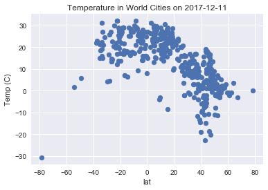
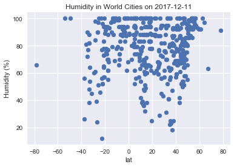
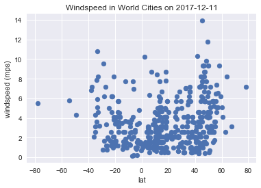
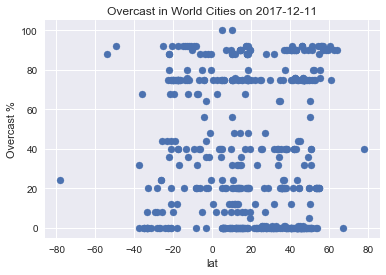

### Observations

1. clear correlation of low magnitude latitudes (equatorial) resulting in higher expected temperatures
2. inverse correlation of humidity and windspeed


```python
# Dependencies
import csv
import matplotlib.pyplot as plt
import requests as req
import pandas as pd
import json
import seaborn as sas
import random
import time
sas.set()
```


```python
# Save config information.
api_key = "7cf9bf61a6f057da548dec0093a68b80"
url = "http://api.openweathermap.org/data/2.5/weather?"
units = "metric"

# Build partial query URL
query_url = url + "appid=" + api_key + "&units=" + units + "&q="
```


```python
all_cities = {}
with open('countriesToCities.json.txt', 'r',encoding='utf-8') as myfile:
    all_cities = json.loads(myfile.read())
```


```python
weather_data = {}
found = 0
countryKeys = [val for val in all_cities.keys()]
# Loop through the list of cities and perform a request for data on each
while found<500:
    curCountry = random.choice(countryKeys)
    curCity = random.choice(all_cities[curCountry])
    cityCountryKey = curCountry+":"+curCity
    if curCity != '':
        try:
            response = req.get(query_url + curCity).json()
            if response['cod']==200: 
                if  weather_data.get(cityCountryKey,"")=="":
                    weather_data[cityCountryKey]=response
                    found+=1
                    print ('City #'+str(found)+": "+curCountry+", "+curCity+"@ "+query_url + curCity)
            elif response['cod']!=404:
                time.sleep(1)
        except:
            time.sleep(1)
```

    City #1: Slovenia, Borovnica@ http://api.openweathermap.org/data/2.5/weather?appid=7cf9bf61a6f057da548dec0093a68b80&units=metric&q=Borovnica
    City #2: Saint Vincent and the Grenadines, Georgetown@ http://api.openweathermap.org/data/2.5/weather?appid=7cf9bf61a6f057da548dec0093a68b80&units=metric&q=Georgetown
    City #3: Switzerland, Marsens@ http://api.openweathermap.org/data/2.5/weather?appid=7cf9bf61a6f057da548dec0093a68b80&units=metric&q=Marsens
    City #4: Cyprus, Sotira@ http://api.openweathermap.org/data/2.5/weather?appid=7cf9bf61a6f057da548dec0093a68b80&units=metric&q=Sotira
    City #5: Mauritius, Vacoas@ http://api.openweathermap.org/data/2.5/weather?appid=7cf9bf61a6f057da548dec0093a68b80&units=metric&q=Vacoas
    City #6: Uzbekistan, Tashkent@ http://api.openweathermap.org/data/2.5/weather?appid=7cf9bf61a6f057da548dec0093a68b80&units=metric&q=Tashkent
    City #7: Guam, Inarajan Village@ http://api.openweathermap.org/data/2.5/weather?appid=7cf9bf61a6f057da548dec0093a68b80&units=metric&q=Inarajan Village
    City #8: Qatar, Ar Rayyan@ http://api.openweathermap.org/data/2.5/weather?appid=7cf9bf61a6f057da548dec0093a68b80&units=metric&q=Ar Rayyan
    City #9: Mauritania, Nouakchott@ http://api.openweathermap.org/data/2.5/weather?appid=7cf9bf61a6f057da548dec0093a68b80&units=metric&q=Nouakchott
    City #10: Greece, Chania@ http://api.openweathermap.org/data/2.5/weather?appid=7cf9bf61a6f057da548dec0093a68b80&units=metric&q=Chania
    City #11: Estonia, Kuressaare@ http://api.openweathermap.org/data/2.5/weather?appid=7cf9bf61a6f057da548dec0093a68b80&units=metric&q=Kuressaare
    City #12: Jamaica, Moneague@ http://api.openweathermap.org/data/2.5/weather?appid=7cf9bf61a6f057da548dec0093a68b80&units=metric&q=Moneague
    City #13: Belarus, Shklow@ http://api.openweathermap.org/data/2.5/weather?appid=7cf9bf61a6f057da548dec0093a68b80&units=metric&q=Shklow
    City #14: United Arab Emirates, Sharjah@ http://api.openweathermap.org/data/2.5/weather?appid=7cf9bf61a6f057da548dec0093a68b80&units=metric&q=Sharjah
    City #15: Cameroon, Douala@ http://api.openweathermap.org/data/2.5/weather?appid=7cf9bf61a6f057da548dec0093a68b80&units=metric&q=Douala
    City #16: Guadeloupe, Saint-Claude@ http://api.openweathermap.org/data/2.5/weather?appid=7cf9bf61a6f057da548dec0093a68b80&units=metric&q=Saint-Claude
    City #17: Laos, Vientiane@ http://api.openweathermap.org/data/2.5/weather?appid=7cf9bf61a6f057da548dec0093a68b80&units=metric&q=Vientiane
    City #18: Madagascar, Fianarantsoa@ http://api.openweathermap.org/data/2.5/weather?appid=7cf9bf61a6f057da548dec0093a68b80&units=metric&q=Fianarantsoa
    City #19: Cameroon, Bamenda@ http://api.openweathermap.org/data/2.5/weather?appid=7cf9bf61a6f057da548dec0093a68b80&units=metric&q=Bamenda
    City #20: Angola, Huambo@ http://api.openweathermap.org/data/2.5/weather?appid=7cf9bf61a6f057da548dec0093a68b80&units=metric&q=Huambo
    City #21: New Zealand, Waipu@ http://api.openweathermap.org/data/2.5/weather?appid=7cf9bf61a6f057da548dec0093a68b80&units=metric&q=Waipu
    City #22: Netherlands, Buren@ http://api.openweathermap.org/data/2.5/weather?appid=7cf9bf61a6f057da548dec0093a68b80&units=metric&q=Buren
    City #23: Djibouti, Djibouti@ http://api.openweathermap.org/data/2.5/weather?appid=7cf9bf61a6f057da548dec0093a68b80&units=metric&q=Djibouti
    City #24: North Korea, Pyongyang@ http://api.openweathermap.org/data/2.5/weather?appid=7cf9bf61a6f057da548dec0093a68b80&units=metric&q=Pyongyang
    City #25: Yemen, Aden@ http://api.openweathermap.org/data/2.5/weather?appid=7cf9bf61a6f057da548dec0093a68b80&units=metric&q=Aden
    City #26: Argentina, Villa Madero@ http://api.openweathermap.org/data/2.5/weather?appid=7cf9bf61a6f057da548dec0093a68b80&units=metric&q=Villa Madero
    City #27: Cuba, Habana@ http://api.openweathermap.org/data/2.5/weather?appid=7cf9bf61a6f057da548dec0093a68b80&units=metric&q=Habana
    City #28: Liechtenstein, Ruggell@ http://api.openweathermap.org/data/2.5/weather?appid=7cf9bf61a6f057da548dec0093a68b80&units=metric&q=Ruggell
    City #29: Equatorial Guinea, Malabo@ http://api.openweathermap.org/data/2.5/weather?appid=7cf9bf61a6f057da548dec0093a68b80&units=metric&q=Malabo
    City #30: Namibia, Oranjemund@ http://api.openweathermap.org/data/2.5/weather?appid=7cf9bf61a6f057da548dec0093a68b80&units=metric&q=Oranjemund
    City #31: Cook Islands, Avarua@ http://api.openweathermap.org/data/2.5/weather?appid=7cf9bf61a6f057da548dec0093a68b80&units=metric&q=Avarua
    City #32: Suriname, Brownsweg@ http://api.openweathermap.org/data/2.5/weather?appid=7cf9bf61a6f057da548dec0093a68b80&units=metric&q=Brownsweg
    City #33: Maldives, Naifaru@ http://api.openweathermap.org/data/2.5/weather?appid=7cf9bf61a6f057da548dec0093a68b80&units=metric&q=Naifaru
    City #34: India, Chhota Udepur@ http://api.openweathermap.org/data/2.5/weather?appid=7cf9bf61a6f057da548dec0093a68b80&units=metric&q=Chhota Udepur
    City #35: Kenya, Kisii@ http://api.openweathermap.org/data/2.5/weather?appid=7cf9bf61a6f057da548dec0093a68b80&units=metric&q=Kisii
    City #36: Switzerland, Holderbank@ http://api.openweathermap.org/data/2.5/weather?appid=7cf9bf61a6f057da548dec0093a68b80&units=metric&q=Holderbank
    City #37: Pitcairn Islands, Adamstown@ http://api.openweathermap.org/data/2.5/weather?appid=7cf9bf61a6f057da548dec0093a68b80&units=metric&q=Adamstown
    City #38: Trinidad and Tobago, Debe@ http://api.openweathermap.org/data/2.5/weather?appid=7cf9bf61a6f057da548dec0093a68b80&units=metric&q=Debe
    City #39: Indonesia, Yogyakarta@ http://api.openweathermap.org/data/2.5/weather?appid=7cf9bf61a6f057da548dec0093a68b80&units=metric&q=Yogyakarta
    City #40: Madagascar, Antsirabe@ http://api.openweathermap.org/data/2.5/weather?appid=7cf9bf61a6f057da548dec0093a68b80&units=metric&q=Antsirabe
    City #41: Australia, Limestone@ http://api.openweathermap.org/data/2.5/weather?appid=7cf9bf61a6f057da548dec0093a68b80&units=metric&q=Limestone
    City #42: Macedonia, Novo Selo@ http://api.openweathermap.org/data/2.5/weather?appid=7cf9bf61a6f057da548dec0093a68b80&units=metric&q=Novo Selo
    City #43: Zambia, Ndola@ http://api.openweathermap.org/data/2.5/weather?appid=7cf9bf61a6f057da548dec0093a68b80&units=metric&q=Ndola
    City #44: Slovenia, Poljcane@ http://api.openweathermap.org/data/2.5/weather?appid=7cf9bf61a6f057da548dec0093a68b80&units=metric&q=Poljcane
    City #45: Spain, Martos@ http://api.openweathermap.org/data/2.5/weather?appid=7cf9bf61a6f057da548dec0093a68b80&units=metric&q=Martos
    City #46: French Polynesia, Faaa@ http://api.openweathermap.org/data/2.5/weather?appid=7cf9bf61a6f057da548dec0093a68b80&units=metric&q=Faaa
    City #47: Bolivia, Cochabamba@ http://api.openweathermap.org/data/2.5/weather?appid=7cf9bf61a6f057da548dec0093a68b80&units=metric&q=Cochabamba
    City #48: Argentina, Esperanza@ http://api.openweathermap.org/data/2.5/weather?appid=7cf9bf61a6f057da548dec0093a68b80&units=metric&q=Esperanza
    City #49: Luxembourg, Hagen@ http://api.openweathermap.org/data/2.5/weather?appid=7cf9bf61a6f057da548dec0093a68b80&units=metric&q=Hagen
    City #50: Trinidad and Tobago, Freeport@ http://api.openweathermap.org/data/2.5/weather?appid=7cf9bf61a6f057da548dec0093a68b80&units=metric&q=Freeport
    City #51: Denmark, Holsted@ http://api.openweathermap.org/data/2.5/weather?appid=7cf9bf61a6f057da548dec0093a68b80&units=metric&q=Holsted
    City #52: Chad, Moundou@ http://api.openweathermap.org/data/2.5/weather?appid=7cf9bf61a6f057da548dec0093a68b80&units=metric&q=Moundou
    City #53: French Southern Territories, Port-aux-Francais@ http://api.openweathermap.org/data/2.5/weather?appid=7cf9bf61a6f057da548dec0093a68b80&units=metric&q=Port-aux-Francais
    City #54: Trinidad and Tobago, Sangre Grande@ http://api.openweathermap.org/data/2.5/weather?appid=7cf9bf61a6f057da548dec0093a68b80&units=metric&q=Sangre Grande
    City #55: Senegal, Kaolack@ http://api.openweathermap.org/data/2.5/weather?appid=7cf9bf61a6f057da548dec0093a68b80&units=metric&q=Kaolack
    City #56: Papua New Guinea, Namatanai@ http://api.openweathermap.org/data/2.5/weather?appid=7cf9bf61a6f057da548dec0093a68b80&units=metric&q=Namatanai
    City #57: Ecuador, Portoviejo@ http://api.openweathermap.org/data/2.5/weather?appid=7cf9bf61a6f057da548dec0093a68b80&units=metric&q=Portoviejo
    City #58: Bahamas, Nassau@ http://api.openweathermap.org/data/2.5/weather?appid=7cf9bf61a6f057da548dec0093a68b80&units=metric&q=Nassau
    City #59: Bhutan, Thimphu@ http://api.openweathermap.org/data/2.5/weather?appid=7cf9bf61a6f057da548dec0093a68b80&units=metric&q=Thimphu
    City #60: Cape Verde, Praia@ http://api.openweathermap.org/data/2.5/weather?appid=7cf9bf61a6f057da548dec0093a68b80&units=metric&q=Praia
    City #61: Tajikistan, Khorugh@ http://api.openweathermap.org/data/2.5/weather?appid=7cf9bf61a6f057da548dec0093a68b80&units=metric&q=Khorugh
    City #62: South Africa, Malmesbury@ http://api.openweathermap.org/data/2.5/weather?appid=7cf9bf61a6f057da548dec0093a68b80&units=metric&q=Malmesbury
    City #63: Burkina Faso, Tenkodogo@ http://api.openweathermap.org/data/2.5/weather?appid=7cf9bf61a6f057da548dec0093a68b80&units=metric&q=Tenkodogo
    City #64: Congo, Banana@ http://api.openweathermap.org/data/2.5/weather?appid=7cf9bf61a6f057da548dec0093a68b80&units=metric&q=Banana
    City #65: Tuvalu, Funafuti@ http://api.openweathermap.org/data/2.5/weather?appid=7cf9bf61a6f057da548dec0093a68b80&units=metric&q=Funafuti
    City #66: Greece, Kouvaras@ http://api.openweathermap.org/data/2.5/weather?appid=7cf9bf61a6f057da548dec0093a68b80&units=metric&q=Kouvaras
    City #67: Costa Rica, Desamparados@ http://api.openweathermap.org/data/2.5/weather?appid=7cf9bf61a6f057da548dec0093a68b80&units=metric&q=Desamparados
    City #68: Senegal, Dakar@ http://api.openweathermap.org/data/2.5/weather?appid=7cf9bf61a6f057da548dec0093a68b80&units=metric&q=Dakar
    City #69: New Caledonia, Noumea@ http://api.openweathermap.org/data/2.5/weather?appid=7cf9bf61a6f057da548dec0093a68b80&units=metric&q=Noumea
    City #70: Czech Republic, Novy Knin@ http://api.openweathermap.org/data/2.5/weather?appid=7cf9bf61a6f057da548dec0093a68b80&units=metric&q=Novy Knin
    City #71: Nepal, Palpa@ http://api.openweathermap.org/data/2.5/weather?appid=7cf9bf61a6f057da548dec0093a68b80&units=metric&q=Palpa
    City #72: Guinea, Mamou@ http://api.openweathermap.org/data/2.5/weather?appid=7cf9bf61a6f057da548dec0093a68b80&units=metric&q=Mamou
    City #73: Monaco, Monaco@ http://api.openweathermap.org/data/2.5/weather?appid=7cf9bf61a6f057da548dec0093a68b80&units=metric&q=Monaco
    City #74: Albania, Elbasan@ http://api.openweathermap.org/data/2.5/weather?appid=7cf9bf61a6f057da548dec0093a68b80&units=metric&q=Elbasan
    City #75: Morocco, Oulad Teima@ http://api.openweathermap.org/data/2.5/weather?appid=7cf9bf61a6f057da548dec0093a68b80&units=metric&q=Oulad Teima
    City #76: Togo, Sansanne-Mango@ http://api.openweathermap.org/data/2.5/weather?appid=7cf9bf61a6f057da548dec0093a68b80&units=metric&q=Sansanne-Mango
    City #77: Central African Republic, Bangui@ http://api.openweathermap.org/data/2.5/weather?appid=7cf9bf61a6f057da548dec0093a68b80&units=metric&q=Bangui
    City #78: Saint Kitts and Nevis, Charlestown@ http://api.openweathermap.org/data/2.5/weather?appid=7cf9bf61a6f057da548dec0093a68b80&units=metric&q=Charlestown
    City #79: British Virgin Islands, Tortola@ http://api.openweathermap.org/data/2.5/weather?appid=7cf9bf61a6f057da548dec0093a68b80&units=metric&q=Tortola
    City #80: Samoa, Apia@ http://api.openweathermap.org/data/2.5/weather?appid=7cf9bf61a6f057da548dec0093a68b80&units=metric&q=Apia
    City #81: Benin, Cotonou@ http://api.openweathermap.org/data/2.5/weather?appid=7cf9bf61a6f057da548dec0093a68b80&units=metric&q=Cotonou
    City #82: Switzerland, Thalheim@ http://api.openweathermap.org/data/2.5/weather?appid=7cf9bf61a6f057da548dec0093a68b80&units=metric&q=Thalheim
    City #83: Croatia, Rakitje@ http://api.openweathermap.org/data/2.5/weather?appid=7cf9bf61a6f057da548dec0093a68b80&units=metric&q=Rakitje
    City #84: Malta, Senglea@ http://api.openweathermap.org/data/2.5/weather?appid=7cf9bf61a6f057da548dec0093a68b80&units=metric&q=Senglea
    City #85: Bahamas, Marsh Harbour@ http://api.openweathermap.org/data/2.5/weather?appid=7cf9bf61a6f057da548dec0093a68b80&units=metric&q=Marsh Harbour
    City #86: Réunion, Le Port@ http://api.openweathermap.org/data/2.5/weather?appid=7cf9bf61a6f057da548dec0093a68b80&units=metric&q=Le Port
    City #87: Switzerland, Balgach@ http://api.openweathermap.org/data/2.5/weather?appid=7cf9bf61a6f057da548dec0093a68b80&units=metric&q=Balgach
    City #88: Lesotho, Maseru@ http://api.openweathermap.org/data/2.5/weather?appid=7cf9bf61a6f057da548dec0093a68b80&units=metric&q=Maseru
    City #89: Colombia, Riohacha@ http://api.openweathermap.org/data/2.5/weather?appid=7cf9bf61a6f057da548dec0093a68b80&units=metric&q=Riohacha
    City #90: Pakistan, Khanpur@ http://api.openweathermap.org/data/2.5/weather?appid=7cf9bf61a6f057da548dec0093a68b80&units=metric&q=Khanpur
    City #91: Guatemala, Retalhuleu@ http://api.openweathermap.org/data/2.5/weather?appid=7cf9bf61a6f057da548dec0093a68b80&units=metric&q=Retalhuleu
    City #92: India, Jalesar@ http://api.openweathermap.org/data/2.5/weather?appid=7cf9bf61a6f057da548dec0093a68b80&units=metric&q=Jalesar
    City #93: Cuba, Santiago de Cuba@ http://api.openweathermap.org/data/2.5/weather?appid=7cf9bf61a6f057da548dec0093a68b80&units=metric&q=Santiago de Cuba
    City #94: Hungary, Rackeresztur@ http://api.openweathermap.org/data/2.5/weather?appid=7cf9bf61a6f057da548dec0093a68b80&units=metric&q=Rackeresztur
    City #95: Kazakhstan, Karagandy@ http://api.openweathermap.org/data/2.5/weather?appid=7cf9bf61a6f057da548dec0093a68b80&units=metric&q=Karagandy
    City #96: Ireland, Saggart@ http://api.openweathermap.org/data/2.5/weather?appid=7cf9bf61a6f057da548dec0093a68b80&units=metric&q=Saggart
    City #97: New Caledonia, Paita@ http://api.openweathermap.org/data/2.5/weather?appid=7cf9bf61a6f057da548dec0093a68b80&units=metric&q=Paita
    City #98: Martinique, Sainte-Anne@ http://api.openweathermap.org/data/2.5/weather?appid=7cf9bf61a6f057da548dec0093a68b80&units=metric&q=Sainte-Anne
    City #99: Brazil, Porecatu@ http://api.openweathermap.org/data/2.5/weather?appid=7cf9bf61a6f057da548dec0093a68b80&units=metric&q=Porecatu
    City #100: Venezuela, La Castellana@ http://api.openweathermap.org/data/2.5/weather?appid=7cf9bf61a6f057da548dec0093a68b80&units=metric&q=La Castellana
    City #101: Haiti, Port-au-Prince@ http://api.openweathermap.org/data/2.5/weather?appid=7cf9bf61a6f057da548dec0093a68b80&units=metric&q=Port-au-Prince
    City #102: Algeria, Tizi Ouzou@ http://api.openweathermap.org/data/2.5/weather?appid=7cf9bf61a6f057da548dec0093a68b80&units=metric&q=Tizi Ouzou
    City #103: United Arab Emirates, Dubai@ http://api.openweathermap.org/data/2.5/weather?appid=7cf9bf61a6f057da548dec0093a68b80&units=metric&q=Dubai
    City #104: Isle of Man, Onchan@ http://api.openweathermap.org/data/2.5/weather?appid=7cf9bf61a6f057da548dec0093a68b80&units=metric&q=Onchan
    City #105: Brazil, Agrestina@ http://api.openweathermap.org/data/2.5/weather?appid=7cf9bf61a6f057da548dec0093a68b80&units=metric&q=Agrestina
    City #106: Comoros, Moutsamoudou@ http://api.openweathermap.org/data/2.5/weather?appid=7cf9bf61a6f057da548dec0093a68b80&units=metric&q=Moutsamoudou
    City #107: Swaziland, Piggs Peak@ http://api.openweathermap.org/data/2.5/weather?appid=7cf9bf61a6f057da548dec0093a68b80&units=metric&q=Piggs Peak
    City #108: Republic of Lithuania, Jonava@ http://api.openweathermap.org/data/2.5/weather?appid=7cf9bf61a6f057da548dec0093a68b80&units=metric&q=Jonava
    City #109: Gambia, Banjul@ http://api.openweathermap.org/data/2.5/weather?appid=7cf9bf61a6f057da548dec0093a68b80&units=metric&q=Banjul
    City #110: Réunion, Saint-Louis@ http://api.openweathermap.org/data/2.5/weather?appid=7cf9bf61a6f057da548dec0093a68b80&units=metric&q=Saint-Louis
    City #111: Japan, Minato@ http://api.openweathermap.org/data/2.5/weather?appid=7cf9bf61a6f057da548dec0093a68b80&units=metric&q=Minato
    City #112: Slovenia, Kidricevo@ http://api.openweathermap.org/data/2.5/weather?appid=7cf9bf61a6f057da548dec0093a68b80&units=metric&q=Kidricevo
    City #113: Lebanon, Sidon@ http://api.openweathermap.org/data/2.5/weather?appid=7cf9bf61a6f057da548dec0093a68b80&units=metric&q=Sidon
    City #114: Costa Rica, Escazu@ http://api.openweathermap.org/data/2.5/weather?appid=7cf9bf61a6f057da548dec0093a68b80&units=metric&q=Escazu
    City #115: Palestine, Gaza@ http://api.openweathermap.org/data/2.5/weather?appid=7cf9bf61a6f057da548dec0093a68b80&units=metric&q=Gaza
    City #116: Gibraltar, Gibraltar@ http://api.openweathermap.org/data/2.5/weather?appid=7cf9bf61a6f057da548dec0093a68b80&units=metric&q=Gibraltar
    City #117: French Polynesia, Arue@ http://api.openweathermap.org/data/2.5/weather?appid=7cf9bf61a6f057da548dec0093a68b80&units=metric&q=Arue
    City #118: Kosovo, Prizren@ http://api.openweathermap.org/data/2.5/weather?appid=7cf9bf61a6f057da548dec0093a68b80&units=metric&q=Prizren
    City #119: Guyana, Linden@ http://api.openweathermap.org/data/2.5/weather?appid=7cf9bf61a6f057da548dec0093a68b80&units=metric&q=Linden
    City #120: New Zealand, Te Kauwhata@ http://api.openweathermap.org/data/2.5/weather?appid=7cf9bf61a6f057da548dec0093a68b80&units=metric&q=Te Kauwhata
    City #121: Christmas Island, Flying Fish Cove@ http://api.openweathermap.org/data/2.5/weather?appid=7cf9bf61a6f057da548dec0093a68b80&units=metric&q=Flying Fish Cove
    City #122: Liechtenstein, Schaan@ http://api.openweathermap.org/data/2.5/weather?appid=7cf9bf61a6f057da548dec0093a68b80&units=metric&q=Schaan
    City #123: South Sudan, Juba@ http://api.openweathermap.org/data/2.5/weather?appid=7cf9bf61a6f057da548dec0093a68b80&units=metric&q=Juba
    City #124: Saint Lucia, Gros Islet@ http://api.openweathermap.org/data/2.5/weather?appid=7cf9bf61a6f057da548dec0093a68b80&units=metric&q=Gros Islet
    City #125: Azerbaijan, Quba@ http://api.openweathermap.org/data/2.5/weather?appid=7cf9bf61a6f057da548dec0093a68b80&units=metric&q=Quba
    City #126: Slovenia, Dravograd@ http://api.openweathermap.org/data/2.5/weather?appid=7cf9bf61a6f057da548dec0093a68b80&units=metric&q=Dravograd
    City #127: Ivory Coast, Abidjan@ http://api.openweathermap.org/data/2.5/weather?appid=7cf9bf61a6f057da548dec0093a68b80&units=metric&q=Abidjan
    City #128: Fiji, Suva@ http://api.openweathermap.org/data/2.5/weather?appid=7cf9bf61a6f057da548dec0093a68b80&units=metric&q=Suva
    City #129: United States, Cunningham@ http://api.openweathermap.org/data/2.5/weather?appid=7cf9bf61a6f057da548dec0093a68b80&units=metric&q=Cunningham
    City #130: Solomon Islands, Honiara@ http://api.openweathermap.org/data/2.5/weather?appid=7cf9bf61a6f057da548dec0093a68b80&units=metric&q=Honiara
    City #131: Bosnia and Herzegovina, Doboj@ http://api.openweathermap.org/data/2.5/weather?appid=7cf9bf61a6f057da548dec0093a68b80&units=metric&q=Doboj
    City #132: Jamaica, Negril@ http://api.openweathermap.org/data/2.5/weather?appid=7cf9bf61a6f057da548dec0093a68b80&units=metric&q=Negril
    City #133: Tanzania, Tanga@ http://api.openweathermap.org/data/2.5/weather?appid=7cf9bf61a6f057da548dec0093a68b80&units=metric&q=Tanga
    City #134: Iceland, Hella@ http://api.openweathermap.org/data/2.5/weather?appid=7cf9bf61a6f057da548dec0093a68b80&units=metric&q=Hella
    City #135: San Marino, Acquaviva@ http://api.openweathermap.org/data/2.5/weather?appid=7cf9bf61a6f057da548dec0093a68b80&units=metric&q=Acquaviva
    City #136: Andorra, Encamp@ http://api.openweathermap.org/data/2.5/weather?appid=7cf9bf61a6f057da548dec0093a68b80&units=metric&q=Encamp
    City #137: Turkey, Guzelyurt@ http://api.openweathermap.org/data/2.5/weather?appid=7cf9bf61a6f057da548dec0093a68b80&units=metric&q=Guzelyurt
    City #138: Algeria, Djelfa@ http://api.openweathermap.org/data/2.5/weather?appid=7cf9bf61a6f057da548dec0093a68b80&units=metric&q=Djelfa
    City #139: South Georgia and the South Sandwich Islands, Grytviken@ http://api.openweathermap.org/data/2.5/weather?appid=7cf9bf61a6f057da548dec0093a68b80&units=metric&q=Grytviken
    City #140: Turkmenistan, Darganata@ http://api.openweathermap.org/data/2.5/weather?appid=7cf9bf61a6f057da548dec0093a68b80&units=metric&q=Darganata
    City #141: Zimbabwe, Chinhoyi@ http://api.openweathermap.org/data/2.5/weather?appid=7cf9bf61a6f057da548dec0093a68b80&units=metric&q=Chinhoyi
    City #142: Ireland, Artane@ http://api.openweathermap.org/data/2.5/weather?appid=7cf9bf61a6f057da548dec0093a68b80&units=metric&q=Artane
    City #143: Namibia, Keetmanshoop@ http://api.openweathermap.org/data/2.5/weather?appid=7cf9bf61a6f057da548dec0093a68b80&units=metric&q=Keetmanshoop
    City #144: Malta, Qormi@ http://api.openweathermap.org/data/2.5/weather?appid=7cf9bf61a6f057da548dec0093a68b80&units=metric&q=Qormi
    City #145: Belarus, Polatsk@ http://api.openweathermap.org/data/2.5/weather?appid=7cf9bf61a6f057da548dec0093a68b80&units=metric&q=Polatsk
    City #146: Tunisia, Tunis@ http://api.openweathermap.org/data/2.5/weather?appid=7cf9bf61a6f057da548dec0093a68b80&units=metric&q=Tunis
    City #147: Saint Helena, Jamestown@ http://api.openweathermap.org/data/2.5/weather?appid=7cf9bf61a6f057da548dec0093a68b80&units=metric&q=Jamestown
    City #148: Kazakhstan, Shymkent@ http://api.openweathermap.org/data/2.5/weather?appid=7cf9bf61a6f057da548dec0093a68b80&units=metric&q=Shymkent
    City #149: Isle of Man, Ballasalla@ http://api.openweathermap.org/data/2.5/weather?appid=7cf9bf61a6f057da548dec0093a68b80&units=metric&q=Ballasalla
    City #150: Sierra Leone, Freetown@ http://api.openweathermap.org/data/2.5/weather?appid=7cf9bf61a6f057da548dec0093a68b80&units=metric&q=Freetown
    City #151: Latvia, Adazi@ http://api.openweathermap.org/data/2.5/weather?appid=7cf9bf61a6f057da548dec0093a68b80&units=metric&q=Adazi
    City #152: Latvia, Daugavpils@ http://api.openweathermap.org/data/2.5/weather?appid=7cf9bf61a6f057da548dec0093a68b80&units=metric&q=Daugavpils
    City #153: Congo, Likasi@ http://api.openweathermap.org/data/2.5/weather?appid=7cf9bf61a6f057da548dec0093a68b80&units=metric&q=Likasi
    City #154: Martinique, Les Trois-Ilets@ http://api.openweathermap.org/data/2.5/weather?appid=7cf9bf61a6f057da548dec0093a68b80&units=metric&q=Les Trois-Ilets
    City #155: Uruguay, Punta del Este@ http://api.openweathermap.org/data/2.5/weather?appid=7cf9bf61a6f057da548dec0093a68b80&units=metric&q=Punta del Este
    City #156: Guatemala, Central@ http://api.openweathermap.org/data/2.5/weather?appid=7cf9bf61a6f057da548dec0093a68b80&units=metric&q=Central
    City #157: Zimbabwe, Victoria Falls@ http://api.openweathermap.org/data/2.5/weather?appid=7cf9bf61a6f057da548dec0093a68b80&units=metric&q=Victoria Falls
    City #158: Indonesia, Nganjuk@ http://api.openweathermap.org/data/2.5/weather?appid=7cf9bf61a6f057da548dec0093a68b80&units=metric&q=Nganjuk
    City #159: Peru, Cajamarca@ http://api.openweathermap.org/data/2.5/weather?appid=7cf9bf61a6f057da548dec0093a68b80&units=metric&q=Cajamarca
    City #160: Papua New Guinea, Lorengau@ http://api.openweathermap.org/data/2.5/weather?appid=7cf9bf61a6f057da548dec0093a68b80&units=metric&q=Lorengau
    City #161: Guatemala, El Limon@ http://api.openweathermap.org/data/2.5/weather?appid=7cf9bf61a6f057da548dec0093a68b80&units=metric&q=El Limon
    City #162: Zimbabwe, Bulawayo@ http://api.openweathermap.org/data/2.5/weather?appid=7cf9bf61a6f057da548dec0093a68b80&units=metric&q=Bulawayo
    City #163: Brunei, Bandar Seri Begawan@ http://api.openweathermap.org/data/2.5/weather?appid=7cf9bf61a6f057da548dec0093a68b80&units=metric&q=Bandar Seri Begawan
    City #164: New Caledonia, Dumbea@ http://api.openweathermap.org/data/2.5/weather?appid=7cf9bf61a6f057da548dec0093a68b80&units=metric&q=Dumbea
    City #165: Ghana, Takoradi@ http://api.openweathermap.org/data/2.5/weather?appid=7cf9bf61a6f057da548dec0093a68b80&units=metric&q=Takoradi
    City #166: East Timor, Dili@ http://api.openweathermap.org/data/2.5/weather?appid=7cf9bf61a6f057da548dec0093a68b80&units=metric&q=Dili
    City #167: Andorra, Ordino@ http://api.openweathermap.org/data/2.5/weather?appid=7cf9bf61a6f057da548dec0093a68b80&units=metric&q=Ordino
    City #168: Jersey, Saint Peter@ http://api.openweathermap.org/data/2.5/weather?appid=7cf9bf61a6f057da548dec0093a68b80&units=metric&q=Saint Peter
    City #169: Dominica, Berekua@ http://api.openweathermap.org/data/2.5/weather?appid=7cf9bf61a6f057da548dec0093a68b80&units=metric&q=Berekua
    City #170: India, Bodhan@ http://api.openweathermap.org/data/2.5/weather?appid=7cf9bf61a6f057da548dec0093a68b80&units=metric&q=Bodhan
    City #171: Brazil, Prata@ http://api.openweathermap.org/data/2.5/weather?appid=7cf9bf61a6f057da548dec0093a68b80&units=metric&q=Prata
    City #172: France, Vaucouleurs@ http://api.openweathermap.org/data/2.5/weather?appid=7cf9bf61a6f057da548dec0093a68b80&units=metric&q=Vaucouleurs
    City #173: Armenia, Kapan@ http://api.openweathermap.org/data/2.5/weather?appid=7cf9bf61a6f057da548dec0093a68b80&units=metric&q=Kapan
    City #174: Mayotte, Chiconi@ http://api.openweathermap.org/data/2.5/weather?appid=7cf9bf61a6f057da548dec0093a68b80&units=metric&q=Chiconi
    City #175: Trinidad and Tobago, Siparia@ http://api.openweathermap.org/data/2.5/weather?appid=7cf9bf61a6f057da548dec0093a68b80&units=metric&q=Siparia
    City #176: Guinea, Kankan@ http://api.openweathermap.org/data/2.5/weather?appid=7cf9bf61a6f057da548dec0093a68b80&units=metric&q=Kankan
    City #177: Guyana, Georgetown@ http://api.openweathermap.org/data/2.5/weather?appid=7cf9bf61a6f057da548dec0093a68b80&units=metric&q=Georgetown
    City #178: Romania, Cobadin@ http://api.openweathermap.org/data/2.5/weather?appid=7cf9bf61a6f057da548dec0093a68b80&units=metric&q=Cobadin
    City #179: Cayman Islands, Bodden Town@ http://api.openweathermap.org/data/2.5/weather?appid=7cf9bf61a6f057da548dec0093a68b80&units=metric&q=Bodden Town
    City #180: British Virgin Islands, Road Town@ http://api.openweathermap.org/data/2.5/weather?appid=7cf9bf61a6f057da548dec0093a68b80&units=metric&q=Road Town
    City #181: Chile, Calama@ http://api.openweathermap.org/data/2.5/weather?appid=7cf9bf61a6f057da548dec0093a68b80&units=metric&q=Calama
    City #182: Finland, Muurla@ http://api.openweathermap.org/data/2.5/weather?appid=7cf9bf61a6f057da548dec0093a68b80&units=metric&q=Muurla
    City #183: Saudi Arabia, Jeddah@ http://api.openweathermap.org/data/2.5/weather?appid=7cf9bf61a6f057da548dec0093a68b80&units=metric&q=Jeddah
    City #184: Azerbaijan, Baku@ http://api.openweathermap.org/data/2.5/weather?appid=7cf9bf61a6f057da548dec0093a68b80&units=metric&q=Baku
    City #185: Hungary, Simontornya@ http://api.openweathermap.org/data/2.5/weather?appid=7cf9bf61a6f057da548dec0093a68b80&units=metric&q=Simontornya
    City #186: Italy, Palazzo@ http://api.openweathermap.org/data/2.5/weather?appid=7cf9bf61a6f057da548dec0093a68b80&units=metric&q=Palazzo
    City #187: Niger, Niamey@ http://api.openweathermap.org/data/2.5/weather?appid=7cf9bf61a6f057da548dec0093a68b80&units=metric&q=Niamey
    City #188: Papua New Guinea, Aitape@ http://api.openweathermap.org/data/2.5/weather?appid=7cf9bf61a6f057da548dec0093a68b80&units=metric&q=Aitape
    City #189: Germany, Alexander@ http://api.openweathermap.org/data/2.5/weather?appid=7cf9bf61a6f057da548dec0093a68b80&units=metric&q=Alexander
    City #190: Slovenia, Kobarid@ http://api.openweathermap.org/data/2.5/weather?appid=7cf9bf61a6f057da548dec0093a68b80&units=metric&q=Kobarid
    City #191: Argentina, Roldan@ http://api.openweathermap.org/data/2.5/weather?appid=7cf9bf61a6f057da548dec0093a68b80&units=metric&q=Roldan
    City #192: Kazakhstan, Kentau@ http://api.openweathermap.org/data/2.5/weather?appid=7cf9bf61a6f057da548dec0093a68b80&units=metric&q=Kentau
    City #193: Bolivia, La Paz@ http://api.openweathermap.org/data/2.5/weather?appid=7cf9bf61a6f057da548dec0093a68b80&units=metric&q=La Paz
    City #194: Bulgaria, Tutrakan@ http://api.openweathermap.org/data/2.5/weather?appid=7cf9bf61a6f057da548dec0093a68b80&units=metric&q=Tutrakan
    City #195: Greece, Nea Smyrni@ http://api.openweathermap.org/data/2.5/weather?appid=7cf9bf61a6f057da548dec0093a68b80&units=metric&q=Nea Smyrni
    City #196: Svalbard and Jan Mayen, Longyearbyen@ http://api.openweathermap.org/data/2.5/weather?appid=7cf9bf61a6f057da548dec0093a68b80&units=metric&q=Longyearbyen
    City #197: French Polynesia, Mahina@ http://api.openweathermap.org/data/2.5/weather?appid=7cf9bf61a6f057da548dec0093a68b80&units=metric&q=Mahina
    City #198: Uganda, Kampala@ http://api.openweathermap.org/data/2.5/weather?appid=7cf9bf61a6f057da548dec0093a68b80&units=metric&q=Kampala
    City #199: Aruba, Sabaneta@ http://api.openweathermap.org/data/2.5/weather?appid=7cf9bf61a6f057da548dec0093a68b80&units=metric&q=Sabaneta
    City #200: Greece, Galatsi@ http://api.openweathermap.org/data/2.5/weather?appid=7cf9bf61a6f057da548dec0093a68b80&units=metric&q=Galatsi
    City #201: Kenya, Wote@ http://api.openweathermap.org/data/2.5/weather?appid=7cf9bf61a6f057da548dec0093a68b80&units=metric&q=Wote
    City #202: Croatia, Petrinja@ http://api.openweathermap.org/data/2.5/weather?appid=7cf9bf61a6f057da548dec0093a68b80&units=metric&q=Petrinja
    City #203: Tokelau, Atafu Village@ http://api.openweathermap.org/data/2.5/weather?appid=7cf9bf61a6f057da548dec0093a68b80&units=metric&q=Atafu Village
    City #204: Ghana, Tema@ http://api.openweathermap.org/data/2.5/weather?appid=7cf9bf61a6f057da548dec0093a68b80&units=metric&q=Tema
    City #205: Armenia, Aparan@ http://api.openweathermap.org/data/2.5/weather?appid=7cf9bf61a6f057da548dec0093a68b80&units=metric&q=Aparan
    City #206: Liechtenstein, Schellenberg@ http://api.openweathermap.org/data/2.5/weather?appid=7cf9bf61a6f057da548dec0093a68b80&units=metric&q=Schellenberg
    City #207: Lebanon, Baabda@ http://api.openweathermap.org/data/2.5/weather?appid=7cf9bf61a6f057da548dec0093a68b80&units=metric&q=Baabda
    City #208: Egypt, Rafah@ http://api.openweathermap.org/data/2.5/weather?appid=7cf9bf61a6f057da548dec0093a68b80&units=metric&q=Rafah
    City #209: Sri Lanka, Battaramulla South@ http://api.openweathermap.org/data/2.5/weather?appid=7cf9bf61a6f057da548dec0093a68b80&units=metric&q=Battaramulla South
    City #210: Swaziland, Lobamba@ http://api.openweathermap.org/data/2.5/weather?appid=7cf9bf61a6f057da548dec0093a68b80&units=metric&q=Lobamba
    City #211: United States, Forsyth@ http://api.openweathermap.org/data/2.5/weather?appid=7cf9bf61a6f057da548dec0093a68b80&units=metric&q=Forsyth
    City #212: South Africa, Alice@ http://api.openweathermap.org/data/2.5/weather?appid=7cf9bf61a6f057da548dec0093a68b80&units=metric&q=Alice
    City #213: Haiti, Petionville@ http://api.openweathermap.org/data/2.5/weather?appid=7cf9bf61a6f057da548dec0093a68b80&units=metric&q=Petionville
    City #214: Serbia, Savski Venac@ http://api.openweathermap.org/data/2.5/weather?appid=7cf9bf61a6f057da548dec0093a68b80&units=metric&q=Savski Venac
    City #215: Tanzania, Njombe@ http://api.openweathermap.org/data/2.5/weather?appid=7cf9bf61a6f057da548dec0093a68b80&units=metric&q=Njombe
    City #216: Curaçao, Willemstad@ http://api.openweathermap.org/data/2.5/weather?appid=7cf9bf61a6f057da548dec0093a68b80&units=metric&q=Willemstad
    City #217: Botswana, Serowe@ http://api.openweathermap.org/data/2.5/weather?appid=7cf9bf61a6f057da548dec0093a68b80&units=metric&q=Serowe
    City #218: Martinique, Saint-Esprit@ http://api.openweathermap.org/data/2.5/weather?appid=7cf9bf61a6f057da548dec0093a68b80&units=metric&q=Saint-Esprit
    City #219: Fiji, Nadi@ http://api.openweathermap.org/data/2.5/weather?appid=7cf9bf61a6f057da548dec0093a68b80&units=metric&q=Nadi
    City #220: Switzerland, Stallikon@ http://api.openweathermap.org/data/2.5/weather?appid=7cf9bf61a6f057da548dec0093a68b80&units=metric&q=Stallikon
    City #221: Senegal, Louga@ http://api.openweathermap.org/data/2.5/weather?appid=7cf9bf61a6f057da548dec0093a68b80&units=metric&q=Louga
    City #222: Czech Republic, Kralovice@ http://api.openweathermap.org/data/2.5/weather?appid=7cf9bf61a6f057da548dec0093a68b80&units=metric&q=Kralovice
    City #223: Bahamas, Andros Town@ http://api.openweathermap.org/data/2.5/weather?appid=7cf9bf61a6f057da548dec0093a68b80&units=metric&q=Andros Town
    City #224: Netherlands, Venlo@ http://api.openweathermap.org/data/2.5/weather?appid=7cf9bf61a6f057da548dec0093a68b80&units=metric&q=Venlo
    City #225: Italy, Massa@ http://api.openweathermap.org/data/2.5/weather?appid=7cf9bf61a6f057da548dec0093a68b80&units=metric&q=Massa
    City #226: Armenia, Hrazdan@ http://api.openweathermap.org/data/2.5/weather?appid=7cf9bf61a6f057da548dec0093a68b80&units=metric&q=Hrazdan
    City #227: Suriname, Totness@ http://api.openweathermap.org/data/2.5/weather?appid=7cf9bf61a6f057da548dec0093a68b80&units=metric&q=Totness
    City #228: Palestine, Bethlehem@ http://api.openweathermap.org/data/2.5/weather?appid=7cf9bf61a6f057da548dec0093a68b80&units=metric&q=Bethlehem
    City #229: Fiji, Lautoka@ http://api.openweathermap.org/data/2.5/weather?appid=7cf9bf61a6f057da548dec0093a68b80&units=metric&q=Lautoka
    City #230: Tonga, Neiafu@ http://api.openweathermap.org/data/2.5/weather?appid=7cf9bf61a6f057da548dec0093a68b80&units=metric&q=Neiafu
    City #231: Chad, Massaguet@ http://api.openweathermap.org/data/2.5/weather?appid=7cf9bf61a6f057da548dec0093a68b80&units=metric&q=Massaguet
    City #232: Botswana, Francistown@ http://api.openweathermap.org/data/2.5/weather?appid=7cf9bf61a6f057da548dec0093a68b80&units=metric&q=Francistown
    City #233: Poland, Ciechocinek@ http://api.openweathermap.org/data/2.5/weather?appid=7cf9bf61a6f057da548dec0093a68b80&units=metric&q=Ciechocinek
    City #234: Burkina Faso, Ouagadougou@ http://api.openweathermap.org/data/2.5/weather?appid=7cf9bf61a6f057da548dec0093a68b80&units=metric&q=Ouagadougou
    City #235: Guinea-Bissau, Bissau@ http://api.openweathermap.org/data/2.5/weather?appid=7cf9bf61a6f057da548dec0093a68b80&units=metric&q=Bissau
    City #236: Dominica, Marigot@ http://api.openweathermap.org/data/2.5/weather?appid=7cf9bf61a6f057da548dec0093a68b80&units=metric&q=Marigot
    City #237: Barbados, Bagatelle@ http://api.openweathermap.org/data/2.5/weather?appid=7cf9bf61a6f057da548dec0093a68b80&units=metric&q=Bagatelle
    City #238: United States, Napavine@ http://api.openweathermap.org/data/2.5/weather?appid=7cf9bf61a6f057da548dec0093a68b80&units=metric&q=Napavine
    City #239: Saudi Arabia, Abqaiq@ http://api.openweathermap.org/data/2.5/weather?appid=7cf9bf61a6f057da548dec0093a68b80&units=metric&q=Abqaiq
    City #240: Marshall Islands, Majuro@ http://api.openweathermap.org/data/2.5/weather?appid=7cf9bf61a6f057da548dec0093a68b80&units=metric&q=Majuro
    City #241: Colombia, Villamaria@ http://api.openweathermap.org/data/2.5/weather?appid=7cf9bf61a6f057da548dec0093a68b80&units=metric&q=Villamaria
    City #242: Colombia, Mosquera@ http://api.openweathermap.org/data/2.5/weather?appid=7cf9bf61a6f057da548dec0093a68b80&units=metric&q=Mosquera
    City #243: Brazil, Pitangueiras@ http://api.openweathermap.org/data/2.5/weather?appid=7cf9bf61a6f057da548dec0093a68b80&units=metric&q=Pitangueiras
    City #244: Suriname, Friendship@ http://api.openweathermap.org/data/2.5/weather?appid=7cf9bf61a6f057da548dec0093a68b80&units=metric&q=Friendship
    City #245: Republic of Moldova, Orhei@ http://api.openweathermap.org/data/2.5/weather?appid=7cf9bf61a6f057da548dec0093a68b80&units=metric&q=Orhei
    City #246: Pakistan, Karachi@ http://api.openweathermap.org/data/2.5/weather?appid=7cf9bf61a6f057da548dec0093a68b80&units=metric&q=Karachi
    City #247: Saint Vincent and the Grenadines, Union@ http://api.openweathermap.org/data/2.5/weather?appid=7cf9bf61a6f057da548dec0093a68b80&units=metric&q=Union
    City #248: Macao, Taipa@ http://api.openweathermap.org/data/2.5/weather?appid=7cf9bf61a6f057da548dec0093a68b80&units=metric&q=Taipa
    City #249: Malaysia, Tanjung Sepat@ http://api.openweathermap.org/data/2.5/weather?appid=7cf9bf61a6f057da548dec0093a68b80&units=metric&q=Tanjung Sepat
    City #250: New Caledonia, Mont-Dore@ http://api.openweathermap.org/data/2.5/weather?appid=7cf9bf61a6f057da548dec0093a68b80&units=metric&q=Mont-Dore
    City #251: Romania, Bocsa@ http://api.openweathermap.org/data/2.5/weather?appid=7cf9bf61a6f057da548dec0093a68b80&units=metric&q=Bocsa
    City #252: Ukraine, Nadezhda@ http://api.openweathermap.org/data/2.5/weather?appid=7cf9bf61a6f057da548dec0093a68b80&units=metric&q=Nadezhda
    City #253: Ethiopia, Jijiga@ http://api.openweathermap.org/data/2.5/weather?appid=7cf9bf61a6f057da548dec0093a68b80&units=metric&q=Jijiga
    City #254: Qatar, Al Wakrah@ http://api.openweathermap.org/data/2.5/weather?appid=7cf9bf61a6f057da548dec0093a68b80&units=metric&q=Al Wakrah
    City #255: Denmark, Trustrup@ http://api.openweathermap.org/data/2.5/weather?appid=7cf9bf61a6f057da548dec0093a68b80&units=metric&q=Trustrup
    City #256: Croatia, Vratisinec@ http://api.openweathermap.org/data/2.5/weather?appid=7cf9bf61a6f057da548dec0093a68b80&units=metric&q=Vratisinec
    City #257: Nicaragua, Matagalpa@ http://api.openweathermap.org/data/2.5/weather?appid=7cf9bf61a6f057da548dec0093a68b80&units=metric&q=Matagalpa
    City #258: Brunei, Seria@ http://api.openweathermap.org/data/2.5/weather?appid=7cf9bf61a6f057da548dec0093a68b80&units=metric&q=Seria
    City #259: Peru, Jaen@ http://api.openweathermap.org/data/2.5/weather?appid=7cf9bf61a6f057da548dec0093a68b80&units=metric&q=Jaen
    City #260: Turkmenistan, Ashgabat@ http://api.openweathermap.org/data/2.5/weather?appid=7cf9bf61a6f057da548dec0093a68b80&units=metric&q=Ashgabat
    City #261: Malaysia, Simpang Empat@ http://api.openweathermap.org/data/2.5/weather?appid=7cf9bf61a6f057da548dec0093a68b80&units=metric&q=Simpang Empat
    City #262: Mexico, Cuautepec@ http://api.openweathermap.org/data/2.5/weather?appid=7cf9bf61a6f057da548dec0093a68b80&units=metric&q=Cuautepec
    City #263: Paraguay, Fuerte Olimpo@ http://api.openweathermap.org/data/2.5/weather?appid=7cf9bf61a6f057da548dec0093a68b80&units=metric&q=Fuerte Olimpo
    City #264: Liechtenstein, Triesen@ http://api.openweathermap.org/data/2.5/weather?appid=7cf9bf61a6f057da548dec0093a68b80&units=metric&q=Triesen
    City #265: Greece, Kalymnos@ http://api.openweathermap.org/data/2.5/weather?appid=7cf9bf61a6f057da548dec0093a68b80&units=metric&q=Kalymnos
    City #266: Barbados, Hastings@ http://api.openweathermap.org/data/2.5/weather?appid=7cf9bf61a6f057da548dec0093a68b80&units=metric&q=Hastings
    City #267: Malaysia, Ranau@ http://api.openweathermap.org/data/2.5/weather?appid=7cf9bf61a6f057da548dec0093a68b80&units=metric&q=Ranau
    City #268: Lebanon, Halba@ http://api.openweathermap.org/data/2.5/weather?appid=7cf9bf61a6f057da548dec0093a68b80&units=metric&q=Halba
    City #269: Australia, Brown Hill@ http://api.openweathermap.org/data/2.5/weather?appid=7cf9bf61a6f057da548dec0093a68b80&units=metric&q=Brown Hill
    City #270: Réunion, Piton@ http://api.openweathermap.org/data/2.5/weather?appid=7cf9bf61a6f057da548dec0093a68b80&units=metric&q=Piton
    City #271: France, Aimargues@ http://api.openweathermap.org/data/2.5/weather?appid=7cf9bf61a6f057da548dec0093a68b80&units=metric&q=Aimargues
    City #272: Ireland, Kells@ http://api.openweathermap.org/data/2.5/weather?appid=7cf9bf61a6f057da548dec0093a68b80&units=metric&q=Kells
    City #273: Ukraine, Kharkiv@ http://api.openweathermap.org/data/2.5/weather?appid=7cf9bf61a6f057da548dec0093a68b80&units=metric&q=Kharkiv
    City #274: Montserrat, Salem@ http://api.openweathermap.org/data/2.5/weather?appid=7cf9bf61a6f057da548dec0093a68b80&units=metric&q=Salem
    City #275: Lebanon, Beirut@ http://api.openweathermap.org/data/2.5/weather?appid=7cf9bf61a6f057da548dec0093a68b80&units=metric&q=Beirut
    City #276: Martinique, Saint-Joseph@ http://api.openweathermap.org/data/2.5/weather?appid=7cf9bf61a6f057da548dec0093a68b80&units=metric&q=Saint-Joseph
    City #277: Myanmar [Burma], Mandalay@ http://api.openweathermap.org/data/2.5/weather?appid=7cf9bf61a6f057da548dec0093a68b80&units=metric&q=Mandalay
    City #278: Sudan, Nyala@ http://api.openweathermap.org/data/2.5/weather?appid=7cf9bf61a6f057da548dec0093a68b80&units=metric&q=Nyala
    City #279: Zambia, Kitwe@ http://api.openweathermap.org/data/2.5/weather?appid=7cf9bf61a6f057da548dec0093a68b80&units=metric&q=Kitwe
    City #280: Niue, Alofi@ http://api.openweathermap.org/data/2.5/weather?appid=7cf9bf61a6f057da548dec0093a68b80&units=metric&q=Alofi
    City #281: El Salvador, Usulutan@ http://api.openweathermap.org/data/2.5/weather?appid=7cf9bf61a6f057da548dec0093a68b80&units=metric&q=Usulutan
    City #282: Iraq, Baghdad@ http://api.openweathermap.org/data/2.5/weather?appid=7cf9bf61a6f057da548dec0093a68b80&units=metric&q=Baghdad
    City #283: Armenia, Abovyan@ http://api.openweathermap.org/data/2.5/weather?appid=7cf9bf61a6f057da548dec0093a68b80&units=metric&q=Abovyan
    City #284: Bulgaria, Alfatar@ http://api.openweathermap.org/data/2.5/weather?appid=7cf9bf61a6f057da548dec0093a68b80&units=metric&q=Alfatar
    City #285: Andorra, La Massana@ http://api.openweathermap.org/data/2.5/weather?appid=7cf9bf61a6f057da548dec0093a68b80&units=metric&q=La Massana
    City #286: Jersey, Saint Helier@ http://api.openweathermap.org/data/2.5/weather?appid=7cf9bf61a6f057da548dec0093a68b80&units=metric&q=Saint Helier
    City #287: Canada, Fort Macleod@ http://api.openweathermap.org/data/2.5/weather?appid=7cf9bf61a6f057da548dec0093a68b80&units=metric&q=Fort Macleod
    City #288: China, Fusheng@ http://api.openweathermap.org/data/2.5/weather?appid=7cf9bf61a6f057da548dec0093a68b80&units=metric&q=Fusheng
    City #289: Afghanistan, Kabul@ http://api.openweathermap.org/data/2.5/weather?appid=7cf9bf61a6f057da548dec0093a68b80&units=metric&q=Kabul
    City #290: Lebanon, Tripoli@ http://api.openweathermap.org/data/2.5/weather?appid=7cf9bf61a6f057da548dec0093a68b80&units=metric&q=Tripoli
    City #291: Ireland, Donegal@ http://api.openweathermap.org/data/2.5/weather?appid=7cf9bf61a6f057da548dec0093a68b80&units=metric&q=Donegal
    City #292: Angola, Ondjiva@ http://api.openweathermap.org/data/2.5/weather?appid=7cf9bf61a6f057da548dec0093a68b80&units=metric&q=Ondjiva
    City #293: Tanzania, Morogoro@ http://api.openweathermap.org/data/2.5/weather?appid=7cf9bf61a6f057da548dec0093a68b80&units=metric&q=Morogoro
    City #294: Libya, Sabha@ http://api.openweathermap.org/data/2.5/weather?appid=7cf9bf61a6f057da548dec0093a68b80&units=metric&q=Sabha
    City #295: Tunisia, Hammamet@ http://api.openweathermap.org/data/2.5/weather?appid=7cf9bf61a6f057da548dec0093a68b80&units=metric&q=Hammamet
    City #296: Gabon, Libreville@ http://api.openweathermap.org/data/2.5/weather?appid=7cf9bf61a6f057da548dec0093a68b80&units=metric&q=Libreville
    City #297: Ukraine, Korostyshiv@ http://api.openweathermap.org/data/2.5/weather?appid=7cf9bf61a6f057da548dec0093a68b80&units=metric&q=Korostyshiv
    City #298: El Salvador, San Miguel@ http://api.openweathermap.org/data/2.5/weather?appid=7cf9bf61a6f057da548dec0093a68b80&units=metric&q=San Miguel
    City #299: Bermuda, Somerset@ http://api.openweathermap.org/data/2.5/weather?appid=7cf9bf61a6f057da548dec0093a68b80&units=metric&q=Somerset
    City #300: Romania, Carbunesti@ http://api.openweathermap.org/data/2.5/weather?appid=7cf9bf61a6f057da548dec0093a68b80&units=metric&q=Carbunesti
    City #301: Ghana, Home@ http://api.openweathermap.org/data/2.5/weather?appid=7cf9bf61a6f057da548dec0093a68b80&units=metric&q=Home
    City #302: Cayman Islands, West Bay@ http://api.openweathermap.org/data/2.5/weather?appid=7cf9bf61a6f057da548dec0093a68b80&units=metric&q=West Bay
    City #303: Nigeria, Warri@ http://api.openweathermap.org/data/2.5/weather?appid=7cf9bf61a6f057da548dec0093a68b80&units=metric&q=Warri
    City #304: United Kingdom, Halstead@ http://api.openweathermap.org/data/2.5/weather?appid=7cf9bf61a6f057da548dec0093a68b80&units=metric&q=Halstead
    City #305: Madagascar, Toliara@ http://api.openweathermap.org/data/2.5/weather?appid=7cf9bf61a6f057da548dec0093a68b80&units=metric&q=Toliara
    City #306: Jamaica, Ocho Rios@ http://api.openweathermap.org/data/2.5/weather?appid=7cf9bf61a6f057da548dec0093a68b80&units=metric&q=Ocho Rios
    City #307: Republic of Moldova, Nisporeni@ http://api.openweathermap.org/data/2.5/weather?appid=7cf9bf61a6f057da548dec0093a68b80&units=metric&q=Nisporeni
    City #308: Italy, Frontone@ http://api.openweathermap.org/data/2.5/weather?appid=7cf9bf61a6f057da548dec0093a68b80&units=metric&q=Frontone
    City #309: Libya, Tripoli@ http://api.openweathermap.org/data/2.5/weather?appid=7cf9bf61a6f057da548dec0093a68b80&units=metric&q=Tripoli
    City #310: Honduras, La Hacienda@ http://api.openweathermap.org/data/2.5/weather?appid=7cf9bf61a6f057da548dec0093a68b80&units=metric&q=La Hacienda
    City #311: Trinidad and Tobago, Santa Cruz@ http://api.openweathermap.org/data/2.5/weather?appid=7cf9bf61a6f057da548dec0093a68b80&units=metric&q=Santa Cruz
    City #312: Bhutan, Paro@ http://api.openweathermap.org/data/2.5/weather?appid=7cf9bf61a6f057da548dec0093a68b80&units=metric&q=Paro
    City #313: Chile, Quilicura@ http://api.openweathermap.org/data/2.5/weather?appid=7cf9bf61a6f057da548dec0093a68b80&units=metric&q=Quilicura
    City #314: Hashemite Kingdom of Jordan, Amman@ http://api.openweathermap.org/data/2.5/weather?appid=7cf9bf61a6f057da548dec0093a68b80&units=metric&q=Amman
    City #315: El Salvador, Gigante@ http://api.openweathermap.org/data/2.5/weather?appid=7cf9bf61a6f057da548dec0093a68b80&units=metric&q=Gigante
    City #316: Puerto Rico, Yauco@ http://api.openweathermap.org/data/2.5/weather?appid=7cf9bf61a6f057da548dec0093a68b80&units=metric&q=Yauco
    City #317: Lebanon, Baalbek@ http://api.openweathermap.org/data/2.5/weather?appid=7cf9bf61a6f057da548dec0093a68b80&units=metric&q=Baalbek
    City #318: Palestine, Nablus@ http://api.openweathermap.org/data/2.5/weather?appid=7cf9bf61a6f057da548dec0093a68b80&units=metric&q=Nablus
    City #319: Saint Kitts and Nevis, Basseterre@ http://api.openweathermap.org/data/2.5/weather?appid=7cf9bf61a6f057da548dec0093a68b80&units=metric&q=Basseterre
    City #320: Anguilla, The Valley@ http://api.openweathermap.org/data/2.5/weather?appid=7cf9bf61a6f057da548dec0093a68b80&units=metric&q=The Valley
    City #321: Nepal, Bharatpur@ http://api.openweathermap.org/data/2.5/weather?appid=7cf9bf61a6f057da548dec0093a68b80&units=metric&q=Bharatpur
    City #322: Puerto Rico, Cidra@ http://api.openweathermap.org/data/2.5/weather?appid=7cf9bf61a6f057da548dec0093a68b80&units=metric&q=Cidra
    City #323: Yemen, Sanaa@ http://api.openweathermap.org/data/2.5/weather?appid=7cf9bf61a6f057da548dec0093a68b80&units=metric&q=Sanaa
    City #324: Congo, Lubumbashi@ http://api.openweathermap.org/data/2.5/weather?appid=7cf9bf61a6f057da548dec0093a68b80&units=metric&q=Lubumbashi
    City #325: Kyrgyzstan, Bishkek@ http://api.openweathermap.org/data/2.5/weather?appid=7cf9bf61a6f057da548dec0093a68b80&units=metric&q=Bishkek
    City #326: Lesotho, Roma@ http://api.openweathermap.org/data/2.5/weather?appid=7cf9bf61a6f057da548dec0093a68b80&units=metric&q=Roma
    City #327: Albania, Shkoder@ http://api.openweathermap.org/data/2.5/weather?appid=7cf9bf61a6f057da548dec0093a68b80&units=metric&q=Shkoder
    City #328: Australia, Hazelbrook@ http://api.openweathermap.org/data/2.5/weather?appid=7cf9bf61a6f057da548dec0093a68b80&units=metric&q=Hazelbrook
    City #329: Bahrain, Madinat Hamad@ http://api.openweathermap.org/data/2.5/weather?appid=7cf9bf61a6f057da548dec0093a68b80&units=metric&q=Madinat Hamad
    City #330: Cocos [Keeling] Islands, West Island@ http://api.openweathermap.org/data/2.5/weather?appid=7cf9bf61a6f057da548dec0093a68b80&units=metric&q=West Island
    City #331: Suriname, Onverwacht@ http://api.openweathermap.org/data/2.5/weather?appid=7cf9bf61a6f057da548dec0093a68b80&units=metric&q=Onverwacht
    City #332: Thailand, Lamphun@ http://api.openweathermap.org/data/2.5/weather?appid=7cf9bf61a6f057da548dec0093a68b80&units=metric&q=Lamphun
    City #333: Germany, Walderbach@ http://api.openweathermap.org/data/2.5/weather?appid=7cf9bf61a6f057da548dec0093a68b80&units=metric&q=Walderbach
    City #334: Bangladesh, Chittagong@ http://api.openweathermap.org/data/2.5/weather?appid=7cf9bf61a6f057da548dec0093a68b80&units=metric&q=Chittagong
    City #335: Gabon, Port-Gentil@ http://api.openweathermap.org/data/2.5/weather?appid=7cf9bf61a6f057da548dec0093a68b80&units=metric&q=Port-Gentil
    City #336: Mexico, Nuevo Casas Grandes@ http://api.openweathermap.org/data/2.5/weather?appid=7cf9bf61a6f057da548dec0093a68b80&units=metric&q=Nuevo Casas Grandes
    City #337: Malta, Xaghra@ http://api.openweathermap.org/data/2.5/weather?appid=7cf9bf61a6f057da548dec0093a68b80&units=metric&q=Xaghra
    City #338: Oman, Muscat@ http://api.openweathermap.org/data/2.5/weather?appid=7cf9bf61a6f057da548dec0093a68b80&units=metric&q=Muscat
    City #339: Colombia, Miami@ http://api.openweathermap.org/data/2.5/weather?appid=7cf9bf61a6f057da548dec0093a68b80&units=metric&q=Miami
    City #340: Canada, Preeceville@ http://api.openweathermap.org/data/2.5/weather?appid=7cf9bf61a6f057da548dec0093a68b80&units=metric&q=Preeceville
    City #341: United Kingdom, Todmorden@ http://api.openweathermap.org/data/2.5/weather?appid=7cf9bf61a6f057da548dec0093a68b80&units=metric&q=Todmorden
    City #342: Panama, Vista Hermosa@ http://api.openweathermap.org/data/2.5/weather?appid=7cf9bf61a6f057da548dec0093a68b80&units=metric&q=Vista Hermosa
    City #343: Guatemala, Esquipulas@ http://api.openweathermap.org/data/2.5/weather?appid=7cf9bf61a6f057da548dec0093a68b80&units=metric&q=Esquipulas
    City #344: Algeria, Blida@ http://api.openweathermap.org/data/2.5/weather?appid=7cf9bf61a6f057da548dec0093a68b80&units=metric&q=Blida
    City #345: Uruguay, La Paz@ http://api.openweathermap.org/data/2.5/weather?appid=7cf9bf61a6f057da548dec0093a68b80&units=metric&q=La Paz
    City #346: Belize, Ladyville@ http://api.openweathermap.org/data/2.5/weather?appid=7cf9bf61a6f057da548dec0093a68b80&units=metric&q=Ladyville
    City #347: Somalia, Mogadishu@ http://api.openweathermap.org/data/2.5/weather?appid=7cf9bf61a6f057da548dec0093a68b80&units=metric&q=Mogadishu
    City #348: Austria, Judenburg@ http://api.openweathermap.org/data/2.5/weather?appid=7cf9bf61a6f057da548dec0093a68b80&units=metric&q=Judenburg
    City #349: Armenia, Jermuk@ http://api.openweathermap.org/data/2.5/weather?appid=7cf9bf61a6f057da548dec0093a68b80&units=metric&q=Jermuk
    City #350: Ghana, Bawku@ http://api.openweathermap.org/data/2.5/weather?appid=7cf9bf61a6f057da548dec0093a68b80&units=metric&q=Bawku
    City #351: Greece, Rio@ http://api.openweathermap.org/data/2.5/weather?appid=7cf9bf61a6f057da548dec0093a68b80&units=metric&q=Rio
    City #352: Congo, Kinshasa@ http://api.openweathermap.org/data/2.5/weather?appid=7cf9bf61a6f057da548dec0093a68b80&units=metric&q=Kinshasa
    City #353: Jamaica, Old Harbour@ http://api.openweathermap.org/data/2.5/weather?appid=7cf9bf61a6f057da548dec0093a68b80&units=metric&q=Old Harbour
    City #354: Kazakhstan, Stepnogorsk@ http://api.openweathermap.org/data/2.5/weather?appid=7cf9bf61a6f057da548dec0093a68b80&units=metric&q=Stepnogorsk
    City #355: Malta, Gudja@ http://api.openweathermap.org/data/2.5/weather?appid=7cf9bf61a6f057da548dec0093a68b80&units=metric&q=Gudja
    City #356: Switzerland, Menziken@ http://api.openweathermap.org/data/2.5/weather?appid=7cf9bf61a6f057da548dec0093a68b80&units=metric&q=Menziken
    City #357: Brazil, Manacapuru@ http://api.openweathermap.org/data/2.5/weather?appid=7cf9bf61a6f057da548dec0093a68b80&units=metric&q=Manacapuru
    City #358: Réunion, Sainte-Suzanne@ http://api.openweathermap.org/data/2.5/weather?appid=7cf9bf61a6f057da548dec0093a68b80&units=metric&q=Sainte-Suzanne
    City #359: Madagascar, Antsiranana@ http://api.openweathermap.org/data/2.5/weather?appid=7cf9bf61a6f057da548dec0093a68b80&units=metric&q=Antsiranana
    City #360: Jamaica, Port Maria@ http://api.openweathermap.org/data/2.5/weather?appid=7cf9bf61a6f057da548dec0093a68b80&units=metric&q=Port Maria
    City #361: Nicaragua, Jinotega@ http://api.openweathermap.org/data/2.5/weather?appid=7cf9bf61a6f057da548dec0093a68b80&units=metric&q=Jinotega
    City #362: Bolivia, Santa Cruz@ http://api.openweathermap.org/data/2.5/weather?appid=7cf9bf61a6f057da548dec0093a68b80&units=metric&q=Santa Cruz
    City #363: Antarctica, Antarctica@ http://api.openweathermap.org/data/2.5/weather?appid=7cf9bf61a6f057da548dec0093a68b80&units=metric&q=Antarctica
    City #364: Romania, Lugoj@ http://api.openweathermap.org/data/2.5/weather?appid=7cf9bf61a6f057da548dec0093a68b80&units=metric&q=Lugoj
    City #365: Trinidad and Tobago, Arouca@ http://api.openweathermap.org/data/2.5/weather?appid=7cf9bf61a6f057da548dec0093a68b80&units=metric&q=Arouca
    City #366: Saudi Arabia, Hayil@ http://api.openweathermap.org/data/2.5/weather?appid=7cf9bf61a6f057da548dec0093a68b80&units=metric&q=Hayil
    City #367: Falkland Islands, Stanley@ http://api.openweathermap.org/data/2.5/weather?appid=7cf9bf61a6f057da548dec0093a68b80&units=metric&q=Stanley
    City #368: Madagascar, Ambanja@ http://api.openweathermap.org/data/2.5/weather?appid=7cf9bf61a6f057da548dec0093a68b80&units=metric&q=Ambanja
    City #369: Isle of Man, Crosby@ http://api.openweathermap.org/data/2.5/weather?appid=7cf9bf61a6f057da548dec0093a68b80&units=metric&q=Crosby
    City #370: Paraguay, Villarrica@ http://api.openweathermap.org/data/2.5/weather?appid=7cf9bf61a6f057da548dec0093a68b80&units=metric&q=Villarrica
    City #371: Venezuela, San Francisco@ http://api.openweathermap.org/data/2.5/weather?appid=7cf9bf61a6f057da548dec0093a68b80&units=metric&q=San Francisco
    City #372: Rwanda, Kigali@ http://api.openweathermap.org/data/2.5/weather?appid=7cf9bf61a6f057da548dec0093a68b80&units=metric&q=Kigali
    City #373: Serbia, Basaid@ http://api.openweathermap.org/data/2.5/weather?appid=7cf9bf61a6f057da548dec0093a68b80&units=metric&q=Basaid
    City #374: Iran, Gorgan@ http://api.openweathermap.org/data/2.5/weather?appid=7cf9bf61a6f057da548dec0093a68b80&units=metric&q=Gorgan
    City #375: Burundi, Bujumbura@ http://api.openweathermap.org/data/2.5/weather?appid=7cf9bf61a6f057da548dec0093a68b80&units=metric&q=Bujumbura
    City #376: Saint-Barthélemy, Gustavia@ http://api.openweathermap.org/data/2.5/weather?appid=7cf9bf61a6f057da548dec0093a68b80&units=metric&q=Gustavia
    City #377: Netherlands, Biest@ http://api.openweathermap.org/data/2.5/weather?appid=7cf9bf61a6f057da548dec0093a68b80&units=metric&q=Biest
    City #378: Argentina, Turdera@ http://api.openweathermap.org/data/2.5/weather?appid=7cf9bf61a6f057da548dec0093a68b80&units=metric&q=Turdera
    City #379: Ecuador, Machachi@ http://api.openweathermap.org/data/2.5/weather?appid=7cf9bf61a6f057da548dec0093a68b80&units=metric&q=Machachi
    City #380: Saint Martin, Marigot@ http://api.openweathermap.org/data/2.5/weather?appid=7cf9bf61a6f057da548dec0093a68b80&units=metric&q=Marigot
    City #381: Tanzania, Arusha@ http://api.openweathermap.org/data/2.5/weather?appid=7cf9bf61a6f057da548dec0093a68b80&units=metric&q=Arusha
    City #382: Egypt, Faraskur@ http://api.openweathermap.org/data/2.5/weather?appid=7cf9bf61a6f057da548dec0093a68b80&units=metric&q=Faraskur
    City #383: Indonesia, Lawang@ http://api.openweathermap.org/data/2.5/weather?appid=7cf9bf61a6f057da548dec0093a68b80&units=metric&q=Lawang
    City #384: Papua New Guinea, Kundiawa@ http://api.openweathermap.org/data/2.5/weather?appid=7cf9bf61a6f057da548dec0093a68b80&units=metric&q=Kundiawa
    City #385: United Kingdom, Gosport@ http://api.openweathermap.org/data/2.5/weather?appid=7cf9bf61a6f057da548dec0093a68b80&units=metric&q=Gosport
    City #386: Argentina, Ramallo@ http://api.openweathermap.org/data/2.5/weather?appid=7cf9bf61a6f057da548dec0093a68b80&units=metric&q=Ramallo
    City #387: Liberia, Fish Town@ http://api.openweathermap.org/data/2.5/weather?appid=7cf9bf61a6f057da548dec0093a68b80&units=metric&q=Fish Town
    City #388: India, Konnagar@ http://api.openweathermap.org/data/2.5/weather?appid=7cf9bf61a6f057da548dec0093a68b80&units=metric&q=Konnagar
    City #389: Ireland, Dalkey@ http://api.openweathermap.org/data/2.5/weather?appid=7cf9bf61a6f057da548dec0093a68b80&units=metric&q=Dalkey
    City #390: Ukraine, Shepetivka@ http://api.openweathermap.org/data/2.5/weather?appid=7cf9bf61a6f057da548dec0093a68b80&units=metric&q=Shepetivka
    City #391: Hungary, Karancskeszi@ http://api.openweathermap.org/data/2.5/weather?appid=7cf9bf61a6f057da548dec0093a68b80&units=metric&q=Karancskeszi
    City #392: Luxembourg, Dalheim@ http://api.openweathermap.org/data/2.5/weather?appid=7cf9bf61a6f057da548dec0093a68b80&units=metric&q=Dalheim
    City #393: Dominica, Roseau@ http://api.openweathermap.org/data/2.5/weather?appid=7cf9bf61a6f057da548dec0093a68b80&units=metric&q=Roseau
    City #394: Grenada, Gouyave@ http://api.openweathermap.org/data/2.5/weather?appid=7cf9bf61a6f057da548dec0093a68b80&units=metric&q=Gouyave
    City #395: Argentina, San Pedro@ http://api.openweathermap.org/data/2.5/weather?appid=7cf9bf61a6f057da548dec0093a68b80&units=metric&q=San Pedro
    City #396: Aruba, Santa Cruz@ http://api.openweathermap.org/data/2.5/weather?appid=7cf9bf61a6f057da548dec0093a68b80&units=metric&q=Santa Cruz
    City #397: Republic of Moldova, Drochia@ http://api.openweathermap.org/data/2.5/weather?appid=7cf9bf61a6f057da548dec0093a68b80&units=metric&q=Drochia
    City #398: Austria, Langenlois@ http://api.openweathermap.org/data/2.5/weather?appid=7cf9bf61a6f057da548dec0093a68b80&units=metric&q=Langenlois
    City #399: India, Kottayam@ http://api.openweathermap.org/data/2.5/weather?appid=7cf9bf61a6f057da548dec0093a68b80&units=metric&q=Kottayam
    City #400: Serbia, Arilje@ http://api.openweathermap.org/data/2.5/weather?appid=7cf9bf61a6f057da548dec0093a68b80&units=metric&q=Arilje
    City #401: Uruguay, Union@ http://api.openweathermap.org/data/2.5/weather?appid=7cf9bf61a6f057da548dec0093a68b80&units=metric&q=Union
    City #402: Republic of the Congo, Brazzaville@ http://api.openweathermap.org/data/2.5/weather?appid=7cf9bf61a6f057da548dec0093a68b80&units=metric&q=Brazzaville
    City #403: Estonia, Peetri@ http://api.openweathermap.org/data/2.5/weather?appid=7cf9bf61a6f057da548dec0093a68b80&units=metric&q=Peetri
    City #404: Tajikistan, Dushanbe@ http://api.openweathermap.org/data/2.5/weather?appid=7cf9bf61a6f057da548dec0093a68b80&units=metric&q=Dushanbe
    City #405: El Salvador, Nuevo Cuscatlan@ http://api.openweathermap.org/data/2.5/weather?appid=7cf9bf61a6f057da548dec0093a68b80&units=metric&q=Nuevo Cuscatlan
    City #406: Zambia, Mumbwa@ http://api.openweathermap.org/data/2.5/weather?appid=7cf9bf61a6f057da548dec0093a68b80&units=metric&q=Mumbwa
    City #407: Netherlands, Vasse@ http://api.openweathermap.org/data/2.5/weather?appid=7cf9bf61a6f057da548dec0093a68b80&units=metric&q=Vasse
    City #408: French Guiana, Remire-Montjoly@ http://api.openweathermap.org/data/2.5/weather?appid=7cf9bf61a6f057da548dec0093a68b80&units=metric&q=Remire-Montjoly
    City #409: El Salvador, Apaneca@ http://api.openweathermap.org/data/2.5/weather?appid=7cf9bf61a6f057da548dec0093a68b80&units=metric&q=Apaneca
    City #410: Romania, Campeni@ http://api.openweathermap.org/data/2.5/weather?appid=7cf9bf61a6f057da548dec0093a68b80&units=metric&q=Campeni
    City #411: Ethiopia, Addis Ababa@ http://api.openweathermap.org/data/2.5/weather?appid=7cf9bf61a6f057da548dec0093a68b80&units=metric&q=Addis Ababa
    City #412: Mexico, Zamora@ http://api.openweathermap.org/data/2.5/weather?appid=7cf9bf61a6f057da548dec0093a68b80&units=metric&q=Zamora
    City #413: Sweden, Karlskrona@ http://api.openweathermap.org/data/2.5/weather?appid=7cf9bf61a6f057da548dec0093a68b80&units=metric&q=Karlskrona
    City #414: Saint Kitts and Nevis, Sandy Point Town@ http://api.openweathermap.org/data/2.5/weather?appid=7cf9bf61a6f057da548dec0093a68b80&units=metric&q=Sandy Point Town
    City #415: Israel, Gedera@ http://api.openweathermap.org/data/2.5/weather?appid=7cf9bf61a6f057da548dec0093a68b80&units=metric&q=Gedera
    City #416: Iceland, Hveragerdi@ http://api.openweathermap.org/data/2.5/weather?appid=7cf9bf61a6f057da548dec0093a68b80&units=metric&q=Hveragerdi
    City #417: Finland, Liperi@ http://api.openweathermap.org/data/2.5/weather?appid=7cf9bf61a6f057da548dec0093a68b80&units=metric&q=Liperi
    City #418: Philippines, Balagtas@ http://api.openweathermap.org/data/2.5/weather?appid=7cf9bf61a6f057da548dec0093a68b80&units=metric&q=Balagtas
    City #419: Tanzania, Zanzibar@ http://api.openweathermap.org/data/2.5/weather?appid=7cf9bf61a6f057da548dec0093a68b80&units=metric&q=Zanzibar
    City #420: Aruba, Oranjestad@ http://api.openweathermap.org/data/2.5/weather?appid=7cf9bf61a6f057da548dec0093a68b80&units=metric&q=Oranjestad
    City #421: Nicaragua, Esteli@ http://api.openweathermap.org/data/2.5/weather?appid=7cf9bf61a6f057da548dec0093a68b80&units=metric&q=Esteli
    City #422: Brazil, Santo Antonio@ http://api.openweathermap.org/data/2.5/weather?appid=7cf9bf61a6f057da548dec0093a68b80&units=metric&q=Santo Antonio
    City #423: Republic of Lithuania, Garliava@ http://api.openweathermap.org/data/2.5/weather?appid=7cf9bf61a6f057da548dec0093a68b80&units=metric&q=Garliava
    City #424: United States, Mechanicsville@ http://api.openweathermap.org/data/2.5/weather?appid=7cf9bf61a6f057da548dec0093a68b80&units=metric&q=Mechanicsville
    City #425: Liberia, Paynesville@ http://api.openweathermap.org/data/2.5/weather?appid=7cf9bf61a6f057da548dec0093a68b80&units=metric&q=Paynesville
    City #426: Mauritius, Quatre Bornes@ http://api.openweathermap.org/data/2.5/weather?appid=7cf9bf61a6f057da548dec0093a68b80&units=metric&q=Quatre Bornes
    City #427: Dominican Republic, Pedernales@ http://api.openweathermap.org/data/2.5/weather?appid=7cf9bf61a6f057da548dec0093a68b80&units=metric&q=Pedernales
    City #428: Kazakhstan, Talghar@ http://api.openweathermap.org/data/2.5/weather?appid=7cf9bf61a6f057da548dec0093a68b80&units=metric&q=Talghar
    City #429: Saint Lucia, Castries@ http://api.openweathermap.org/data/2.5/weather?appid=7cf9bf61a6f057da548dec0093a68b80&units=metric&q=Castries
    City #430: Liechtenstein, Planken@ http://api.openweathermap.org/data/2.5/weather?appid=7cf9bf61a6f057da548dec0093a68b80&units=metric&q=Planken
    City #431: Japan, Ichikawa@ http://api.openweathermap.org/data/2.5/weather?appid=7cf9bf61a6f057da548dec0093a68b80&units=metric&q=Ichikawa
    City #432: Albania, Pogradec@ http://api.openweathermap.org/data/2.5/weather?appid=7cf9bf61a6f057da548dec0093a68b80&units=metric&q=Pogradec
    City #433: Antigua and Barbuda, Parham@ http://api.openweathermap.org/data/2.5/weather?appid=7cf9bf61a6f057da548dec0093a68b80&units=metric&q=Parham
    City #434: Sudan, Shendi@ http://api.openweathermap.org/data/2.5/weather?appid=7cf9bf61a6f057da548dec0093a68b80&units=metric&q=Shendi
    City #435: French Polynesia, Papeete@ http://api.openweathermap.org/data/2.5/weather?appid=7cf9bf61a6f057da548dec0093a68b80&units=metric&q=Papeete
    City #436: Nicaragua, San Juan del Sur@ http://api.openweathermap.org/data/2.5/weather?appid=7cf9bf61a6f057da548dec0093a68b80&units=metric&q=San Juan del Sur
    City #437: Venezuela, Anaco@ http://api.openweathermap.org/data/2.5/weather?appid=7cf9bf61a6f057da548dec0093a68b80&units=metric&q=Anaco
    City #438: Canada, Tappen@ http://api.openweathermap.org/data/2.5/weather?appid=7cf9bf61a6f057da548dec0093a68b80&units=metric&q=Tappen
    City #439: India, Bishnupur@ http://api.openweathermap.org/data/2.5/weather?appid=7cf9bf61a6f057da548dec0093a68b80&units=metric&q=Bishnupur
    City #440: Greece, Kalamaria@ http://api.openweathermap.org/data/2.5/weather?appid=7cf9bf61a6f057da548dec0093a68b80&units=metric&q=Kalamaria
    City #441: Bulgaria, Etropole@ http://api.openweathermap.org/data/2.5/weather?appid=7cf9bf61a6f057da548dec0093a68b80&units=metric&q=Etropole
    City #442: Colombia, Fonseca@ http://api.openweathermap.org/data/2.5/weather?appid=7cf9bf61a6f057da548dec0093a68b80&units=metric&q=Fonseca
    City #443: Malawi, Lilongwe@ http://api.openweathermap.org/data/2.5/weather?appid=7cf9bf61a6f057da548dec0093a68b80&units=metric&q=Lilongwe
    City #444: Japan, Kanagawa@ http://api.openweathermap.org/data/2.5/weather?appid=7cf9bf61a6f057da548dec0093a68b80&units=metric&q=Kanagawa
    City #445: Ukraine, Feodosiya@ http://api.openweathermap.org/data/2.5/weather?appid=7cf9bf61a6f057da548dec0093a68b80&units=metric&q=Feodosiya
    City #446: Afghanistan, Kandahar@ http://api.openweathermap.org/data/2.5/weather?appid=7cf9bf61a6f057da548dec0093a68b80&units=metric&q=Kandahar
    City #447: Zimbabwe, Harare@ http://api.openweathermap.org/data/2.5/weather?appid=7cf9bf61a6f057da548dec0093a68b80&units=metric&q=Harare
    City #448: New Zealand, Winton@ http://api.openweathermap.org/data/2.5/weather?appid=7cf9bf61a6f057da548dec0093a68b80&units=metric&q=Winton
    City #449: Brazil, Roseira@ http://api.openweathermap.org/data/2.5/weather?appid=7cf9bf61a6f057da548dec0093a68b80&units=metric&q=Roseira
    City #450: Slovakia, Sabinov@ http://api.openweathermap.org/data/2.5/weather?appid=7cf9bf61a6f057da548dec0093a68b80&units=metric&q=Sabinov
    City #451: Bermuda, Saint George@ http://api.openweathermap.org/data/2.5/weather?appid=7cf9bf61a6f057da548dec0093a68b80&units=metric&q=Saint George
    City #452: Egypt, Cairo@ http://api.openweathermap.org/data/2.5/weather?appid=7cf9bf61a6f057da548dec0093a68b80&units=metric&q=Cairo
    City #453: Martinique, Le Morne-Rouge@ http://api.openweathermap.org/data/2.5/weather?appid=7cf9bf61a6f057da548dec0093a68b80&units=metric&q=Le Morne-Rouge
    City #454: Dominican Republic, Hato Mayor del Rey@ http://api.openweathermap.org/data/2.5/weather?appid=7cf9bf61a6f057da548dec0093a68b80&units=metric&q=Hato Mayor del Rey
    City #455: Guatemala, San Juan@ http://api.openweathermap.org/data/2.5/weather?appid=7cf9bf61a6f057da548dec0093a68b80&units=metric&q=San Juan
    City #456: Republic of Moldova, Soroca@ http://api.openweathermap.org/data/2.5/weather?appid=7cf9bf61a6f057da548dec0093a68b80&units=metric&q=Soroca
    City #457: Puerto Rico, Yabucoa@ http://api.openweathermap.org/data/2.5/weather?appid=7cf9bf61a6f057da548dec0093a68b80&units=metric&q=Yabucoa
    City #458: Tanzania, Dar es Salaam@ http://api.openweathermap.org/data/2.5/weather?appid=7cf9bf61a6f057da548dec0093a68b80&units=metric&q=Dar es Salaam
    City #459: Bosnia and Herzegovina, Tuzla@ http://api.openweathermap.org/data/2.5/weather?appid=7cf9bf61a6f057da548dec0093a68b80&units=metric&q=Tuzla
    City #460: France, La Gaude@ http://api.openweathermap.org/data/2.5/weather?appid=7cf9bf61a6f057da548dec0093a68b80&units=metric&q=La Gaude
    City #461: Trinidad and Tobago, Marabella@ http://api.openweathermap.org/data/2.5/weather?appid=7cf9bf61a6f057da548dec0093a68b80&units=metric&q=Marabella
    City #462: Romania, Fogarasch@ http://api.openweathermap.org/data/2.5/weather?appid=7cf9bf61a6f057da548dec0093a68b80&units=metric&q=Fogarasch
    City #463: Costa Rica, Siquirres@ http://api.openweathermap.org/data/2.5/weather?appid=7cf9bf61a6f057da548dec0093a68b80&units=metric&q=Siquirres
    City #464: Slovakia, Pezinok@ http://api.openweathermap.org/data/2.5/weather?appid=7cf9bf61a6f057da548dec0093a68b80&units=metric&q=Pezinok
    City #465: Senegal, Kedougou@ http://api.openweathermap.org/data/2.5/weather?appid=7cf9bf61a6f057da548dec0093a68b80&units=metric&q=Kedougou
    City #466: Northern Mariana Islands, Saipan@ http://api.openweathermap.org/data/2.5/weather?appid=7cf9bf61a6f057da548dec0093a68b80&units=metric&q=Saipan
    City #467: Kazakhstan, Almaty@ http://api.openweathermap.org/data/2.5/weather?appid=7cf9bf61a6f057da548dec0093a68b80&units=metric&q=Almaty
    City #468: Italy, Costa@ http://api.openweathermap.org/data/2.5/weather?appid=7cf9bf61a6f057da548dec0093a68b80&units=metric&q=Costa
    City #469: Ecuador, Pasaje@ http://api.openweathermap.org/data/2.5/weather?appid=7cf9bf61a6f057da548dec0093a68b80&units=metric&q=Pasaje
    City #470: Argentina, Guatrache@ http://api.openweathermap.org/data/2.5/weather?appid=7cf9bf61a6f057da548dec0093a68b80&units=metric&q=Guatrache
    City #471: Mongolia, Ulaan-Uul@ http://api.openweathermap.org/data/2.5/weather?appid=7cf9bf61a6f057da548dec0093a68b80&units=metric&q=Ulaan-Uul
    City #472: Cuba, Cienfuegos@ http://api.openweathermap.org/data/2.5/weather?appid=7cf9bf61a6f057da548dec0093a68b80&units=metric&q=Cienfuegos
    City #473: Latvia, Gulbene@ http://api.openweathermap.org/data/2.5/weather?appid=7cf9bf61a6f057da548dec0093a68b80&units=metric&q=Gulbene
    City #474: Sint Maarten, Philipsburg@ http://api.openweathermap.org/data/2.5/weather?appid=7cf9bf61a6f057da548dec0093a68b80&units=metric&q=Philipsburg
    City #475: Albania, Tirana@ http://api.openweathermap.org/data/2.5/weather?appid=7cf9bf61a6f057da548dec0093a68b80&units=metric&q=Tirana
    City #476: Costa Rica, Sabanilla@ http://api.openweathermap.org/data/2.5/weather?appid=7cf9bf61a6f057da548dec0093a68b80&units=metric&q=Sabanilla
    City #477: Syria, Aleppo@ http://api.openweathermap.org/data/2.5/weather?appid=7cf9bf61a6f057da548dec0093a68b80&units=metric&q=Aleppo
    City #478: Sudan, Khartoum@ http://api.openweathermap.org/data/2.5/weather?appid=7cf9bf61a6f057da548dec0093a68b80&units=metric&q=Khartoum
    City #479: Nicaragua, Granada@ http://api.openweathermap.org/data/2.5/weather?appid=7cf9bf61a6f057da548dec0093a68b80&units=metric&q=Granada
    City #480: Kuwait, Al Farwaniyah@ http://api.openweathermap.org/data/2.5/weather?appid=7cf9bf61a6f057da548dec0093a68b80&units=metric&q=Al Farwaniyah
    City #481: Guinea, Dabola@ http://api.openweathermap.org/data/2.5/weather?appid=7cf9bf61a6f057da548dec0093a68b80&units=metric&q=Dabola
    City #482: Brazil, Jeronimo Monteiro@ http://api.openweathermap.org/data/2.5/weather?appid=7cf9bf61a6f057da548dec0093a68b80&units=metric&q=Jeronimo Monteiro
    City #483: Cayman Islands, Coral Gables@ http://api.openweathermap.org/data/2.5/weather?appid=7cf9bf61a6f057da548dec0093a68b80&units=metric&q=Coral Gables
    City #484: Spain, Antigua@ http://api.openweathermap.org/data/2.5/weather?appid=7cf9bf61a6f057da548dec0093a68b80&units=metric&q=Antigua
    City #485: Poland, Sroda Wielkopolska@ http://api.openweathermap.org/data/2.5/weather?appid=7cf9bf61a6f057da548dec0093a68b80&units=metric&q=Sroda Wielkopolska
    City #486: Sri Lanka, Maharagama@ http://api.openweathermap.org/data/2.5/weather?appid=7cf9bf61a6f057da548dec0093a68b80&units=metric&q=Maharagama
    City #487: Pakistan, Lahore@ http://api.openweathermap.org/data/2.5/weather?appid=7cf9bf61a6f057da548dec0093a68b80&units=metric&q=Lahore
    City #488: Isle of Man, Dalby@ http://api.openweathermap.org/data/2.5/weather?appid=7cf9bf61a6f057da548dec0093a68b80&units=metric&q=Dalby
    City #489: Bermuda, Hamilton@ http://api.openweathermap.org/data/2.5/weather?appid=7cf9bf61a6f057da548dec0093a68b80&units=metric&q=Hamilton
    City #490: Mauritius, Port Louis@ http://api.openweathermap.org/data/2.5/weather?appid=7cf9bf61a6f057da548dec0093a68b80&units=metric&q=Port Louis
    City #491: United States, Plymouth@ http://api.openweathermap.org/data/2.5/weather?appid=7cf9bf61a6f057da548dec0093a68b80&units=metric&q=Plymouth
    City #492: France, Rians@ http://api.openweathermap.org/data/2.5/weather?appid=7cf9bf61a6f057da548dec0093a68b80&units=metric&q=Rians
    City #493: Mali, Bamako@ http://api.openweathermap.org/data/2.5/weather?appid=7cf9bf61a6f057da548dec0093a68b80&units=metric&q=Bamako
    City #494: Finland, Humppila@ http://api.openweathermap.org/data/2.5/weather?appid=7cf9bf61a6f057da548dec0093a68b80&units=metric&q=Humppila
    City #495: Poland, Krosno@ http://api.openweathermap.org/data/2.5/weather?appid=7cf9bf61a6f057da548dec0093a68b80&units=metric&q=Krosno
    City #496: Hungary, Hodmezovasarhely@ http://api.openweathermap.org/data/2.5/weather?appid=7cf9bf61a6f057da548dec0093a68b80&units=metric&q=Hodmezovasarhely
    City #497: United Kingdom, Freshwater@ http://api.openweathermap.org/data/2.5/weather?appid=7cf9bf61a6f057da548dec0093a68b80&units=metric&q=Freshwater
    City #498: Aruba, Palm Beach@ http://api.openweathermap.org/data/2.5/weather?appid=7cf9bf61a6f057da548dec0093a68b80&units=metric&q=Palm Beach
    City #499: Chile, La Granja@ http://api.openweathermap.org/data/2.5/weather?appid=7cf9bf61a6f057da548dec0093a68b80&units=metric&q=La Granja
    City #500: Swaziland, Mbabane@ http://api.openweathermap.org/data/2.5/weather?appid=7cf9bf61a6f057da548dec0093a68b80&units=metric&q=Mbabane
    


```python
weather_data_list = [weather_data[val] for val in weather_data.keys()]
```


```python
weather_data_list[0:6]
```


    [{'base': 'stations',
      'clouds': {'all': 75},
      'cod': 200,
      'coord': {'lat': 45.92, 'lon': 14.36},
      'dt': 1513049400,
      'id': 3203677,
      'main': {'humidity': 76,
       'pressure': 1000,
       'temp': 12,
       'temp_max': 12,
       'temp_min': 12},
      'name': 'Borovnica',
      'sys': {'country': 'SI',
       'id': 5882,
       'message': 0.165,
       'sunrise': 1513060507,
       'sunset': 1513091856,
       'type': 1},
      'visibility': 10000,
      'weather': [{'description': 'light rain',
        'icon': '10n',
        'id': 500,
        'main': 'Rain'}],
      'wind': {'deg': 250, 'gust': 8.2, 'speed': 1}},
     {'base': 'stations',
      'clouds': {'all': 0},
      'cod': 200,
      'coord': {'lat': 6.8, 'lon': -58.16},
      'dt': 1513047600,
      'id': 3378644,
      'main': {'humidity': 100,
       'pressure': 1010,
       'temp': 23,
       'temp_max': 23,
       'temp_min': 23},
      'name': 'Georgetown',
      'sys': {'country': 'GY',
       'id': 4343,
       'message': 0.1641,
       'sunrise': 1513072470,
       'sunset': 1513114721,
       'type': 1},
      'visibility': 10000,
      'weather': [{'description': 'clear sky',
        'icon': '01n',
        'id': 800,
        'main': 'Clear'}],
      'wind': {'speed': 1}},
     {'base': 'stations',
      'clouds': {'all': 75},
      'cod': 200,
      'coord': {'lat': 46.66, 'lon': 7.06},
      'dt': 1513048800,
      'id': 2659755,
      'main': {'humidity': 100,
       'pressure': 1002,
       'temp': 2.79,
       'temp_max': 4,
       'temp_min': 2},
      'name': 'Marsens',
      'sys': {'country': 'CH',
       'id': 6013,
       'message': 0.0046,
       'sunrise': 1513062430,
       'sunset': 1513093438,
       'type': 1},
      'visibility': 10000,
      'weather': [{'description': 'light rain',
        'icon': '10n',
        'id': 500,
        'main': 'Rain'}],
      'wind': {'deg': 260, 'speed': 8.2}},
     {'base': 'stations',
      'clouds': {'all': 0},
      'cod': 200,
      'coord': {'lat': 34.73, 'lon': 32.86},
      'dt': 1513049400,
      'id': 146069,
      'main': {'humidity': 81,
       'pressure': 1022,
       'temp': 12.68,
       'temp_max': 14,
       'temp_min': 11},
      'name': 'Sotira',
      'sys': {'country': 'CY',
       'id': 5450,
       'message': 0.1661,
       'sunrise': 1513053989,
       'sunset': 1513089493,
       'type': 1},
      'visibility': 10000,
      'weather': [{'description': 'clear sky',
        'icon': '01n',
        'id': 800,
        'main': 'Clear'}],
      'wind': {'deg': 10, 'speed': 3.6}},
     {'base': 'stations',
      'clouds': {'all': 75},
      'cod': 200,
      'coord': {'lat': -20.3, 'lon': 57.48},
      'dt': 1513047600,
      'id': 933945,
      'main': {'humidity': 94,
       'pressure': 1016,
       'temp': 25,
       'temp_max': 25,
       'temp_min': 25},
      'name': 'Vacoas',
      'sys': {'country': 'MU',
       'id': 6729,
       'message': 0.0082,
       'sunrise': 1513041813,
       'sunset': 1513089857,
       'type': 1},
      'visibility': 10000,
      'weather': [{'description': 'broken clouds',
        'icon': '04d',
        'id': 803,
        'main': 'Clouds'}],
      'wind': {'deg': 360, 'speed': 1.5}},
     {'base': 'stations',
      'clouds': {'all': 90},
      'cod': 200,
      'coord': {'lat': 41.26, 'lon': 69.22},
      'dt': 1513047600,
      'id': 1512569,
      'main': {'humidity': 92,
       'pressure': 1026,
       'temp': -6,
       'temp_max': -6,
       'temp_min': -6},
      'name': 'Tashkent',
      'sys': {'country': 'UZ',
       'id': 7402,
       'message': 0.1655,
       'sunrise': 1513046370,
       'sunset': 1513079652,
       'type': 1},
      'visibility': 3000,
      'weather': [{'description': 'mist',
        'icon': '50d',
        'id': 701,
        'main': 'Mist'}],
      'wind': {'deg': 210, 'speed': 3.1}}]


```python
# Extract interesting data from responses
name_data = [data.get("name") for data in weather_data_list]
lat_data = [data.get("coord").get("lat") for data in weather_data_list]
temp_data = [data.get("main").get("temp") for data in weather_data_list]
humidity_data = [data.get("main").get("humidity") for data in weather_data_list]
windspeed_data = [data.get("wind").get("speed") for data in weather_data_list]
cloud_data = [data.get("clouds").get('all') for data in weather_data_list]

```


```python

weather_data2 = {"temp": temp_data, "lat": lat_data,'name':name_data}
weather_data2 = pd.DataFrame(weather_data2)
weather_data2.head()
# Build a scatter plot for each data type
plt.scatter(weather_data2["lat"], weather_data2["temp"], marker="o")

# Incorporate the other graph properties
plt.title("Temperature in World Cities on 2017-12-11")
plt.ylabel("Temp (C)")
plt.xlabel("lat")
plt.grid(True)

# Save the figure
plt.savefig("TemperatureInWorldCities.png")

# Show plot
plt.show()
```





```python

weather_data2 = {"humidity": humidity_data, "lat": lat_data,'name':name_data}
weather_data2 = pd.DataFrame(weather_data2)
weather_data2.head()
# Build a scatter plot for each data type
plt.scatter(weather_data2["lat"], weather_data2["humidity"], marker="o")

# Incorporate the other graph properties
plt.title("Humidity in World Cities on 2017-12-11")
plt.ylabel("Humidity (%)")
plt.xlabel("lat")
plt.grid(True)

# Save the figure
plt.savefig("HumidityInWorldCities.png")

# Show plot
plt.show()
```





```python

weather_data2 = {"windspeed": windspeed_data, "lat": lat_data,'name':name_data}
weather_data2 = pd.DataFrame(weather_data2)
weather_data2.head()
# Build a scatter plot for each data type
plt.scatter(weather_data2["lat"], weather_data2["windspeed"], marker="o")

# Incorporate the other graph properties
plt.title("Windspeed in World Cities on 2017-12-11")
plt.ylabel("windspeed (mps)")
plt.xlabel("lat")
plt.grid(True)

# Save the figure
plt.savefig("WindspeedInWorldCities.png")

# Show plot
plt.show()
```





```python

weather_data2 = {"cloud": cloud_data, "lat": lat_data,'name':name_data}
weather_data2 = pd.DataFrame(weather_data2)
weather_data2.head()
# Build a scatter plot for each data type
plt.scatter(weather_data2["lat"], weather_data2["cloud"], marker="o")

# Incorporate the other graph properties
plt.title("Overcast in World Cities on 2017-12-11")
plt.ylabel("Overcast %")
plt.xlabel("lat")
plt.grid(True)

# Save the figure
plt.savefig("OvercastInWorldCities.png")

# Show plot
plt.show()
```





```python
weather_data2 = {"temp": temp_data,"humidity": humidity_data,"windspeed": windspeed_data,"cloud": cloud_data, "lat": lat_data,'name':name_data}
weather_data2 = pd.DataFrame(weather_data2)
weather_data2.head()
weather_data2.to_csv("AggregatedValuesUsed.csv")
```


```python
def dict_mapping(arg,prefix = ""):
    ret_val = []
    if(type(arg) is dict):
        for key,val in arg.items():
            ret_val.extend([prefix + '/'+key+curVal for curVal in dict_mapping(val)])
    elif (type(arg) is list):
        for val in arg:
            ret_val.extend([prefix + '/'+str(arg.index(val))+curVal for curVal in dict_mapping(val)])
    else:
        ret_val.append(str(type(arg)))
    from collections import OrderedDict
    OrderedDict((x, True) for x in ret_val).keys()
    return ret_val
```


```python
for val in  dict_mapping(weather_data_list[0]):
    print(val)
```

    /coord/lon<class 'float'>
    /coord/lat<class 'float'>
    /weather/0/id<class 'int'>
    /weather/0/main<class 'str'>
    /weather/0/description<class 'str'>
    /weather/0/icon<class 'str'>
    /base<class 'str'>
    /main/temp<class 'int'>
    /main/pressure<class 'int'>
    /main/humidity<class 'int'>
    /main/temp_min<class 'int'>
    /main/temp_max<class 'int'>
    /visibility<class 'int'>
    /wind/speed<class 'int'>
    /wind/deg<class 'int'>
    /wind/gust<class 'float'>
    /clouds/all<class 'int'>
    /dt<class 'int'>
    /sys/type<class 'int'>
    /sys/id<class 'int'>
    /sys/message<class 'float'>
    /sys/country<class 'str'>
    /sys/sunrise<class 'int'>
    /sys/sunset<class 'int'>
    /id<class 'int'>
    /name<class 'str'>
    /cod<class 'int'>
    
